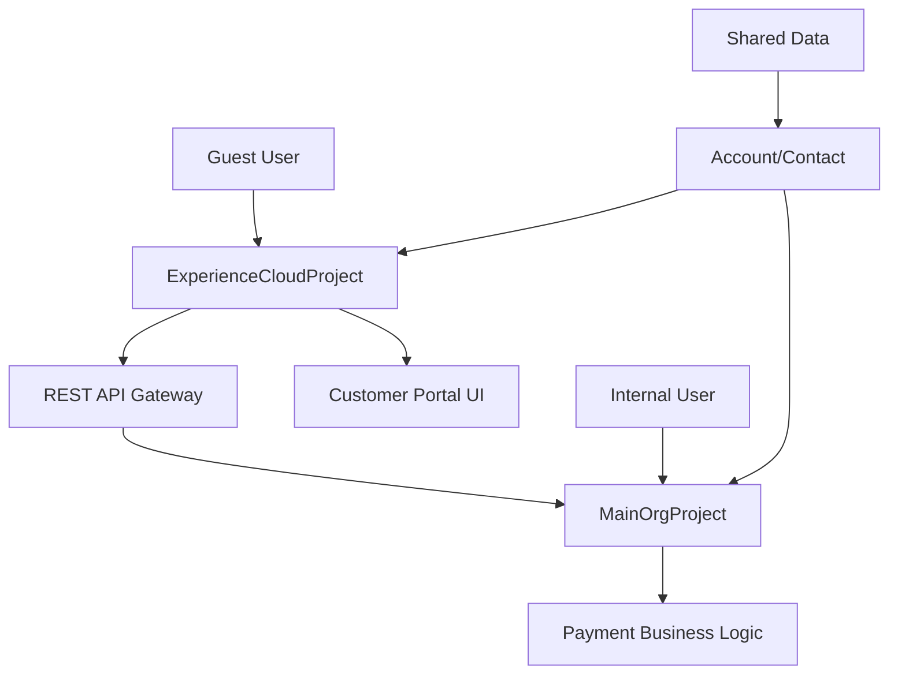

# 🎯 MainOrgProject 현황 분석 및 Experience Cloud 개발 환경 구축 방안

## 📊 현재 상황 분석

### 🏢 **MainOrgProject 현황**

#### 비즈니스 도메인 분석
```yaml
핵심 비즈니스 로직:
  - 결제 관리 시스템 (PaymentStatus__c, Order 관리)
  - 다중 채널 알림 시스템 (이메일, 슬랙, Chatter, Bell 알림)
  - 납부 일정 타임라인 (LWC 기반 UI)
  - PDF 생성 및 첨부 시스템
  - 자동화된 Task 생성 (연체 관리, 완납 처리)

주요 기술 스택:
  - Apex Controllers (결제 관리 로직)
  - Lightning Web Components (관리자용 UI)
  - Trigger & Batch Processing (자동화)
  - ContentVersion API (PDF 관리)
  - Messaging API (다중 채널 알림)
```

#### 데이터 모델 구조
```
Account (고객) 
   ↓
Order (주문) 
   ↓
PaymentStatus__c (납부 현황) 
   ↓
Payment_Notification__c (알림)
```

#### 보안 및 권한 레벨
- **높은 권한**: 전체 Order 및 PaymentStatus 접근
- **내부 사용자 중심**: Sales Team, Admin 대상
- **민감한 데이터**: 결제 정보, 개인정보 처리

---

## 🎯 **권장 솔루션: 하이브리드 접근법**

### 📋 **옵션 A: 별도 프로젝트 분리 (최우선 권장)** 🌟

```yaml
구조:
  MainOrgProject/ (기존 유지)
    - 내부 비즈니스 로직
    - 관리자용 도구
    - 전체 권한 API

  ExperienceCloudProject/ (신규 생성)
    - 고객 포털 UI
    - 제한된 권한 API
    - Guest User 보안 처리
```

#### 장점 분석
```yaml
🔐 보안 분리:
  - Guest User ↔ Internal User 권한 명확 구분
  - 데이터 노출 위험 최소화
  - 각각 독립적 보안 정책

🚀 개발 효율성:
  - 팀별 독립 개발 가능
  - 배포 사이클 분리
  - 테스트 환경 독립

📦 유지보수성:
  - 관심사 분리 (Separation of Concerns)
  - 코드 복잡도 감소
  - 각 프로젝트별 최적화 가능
```

---

### 📋 **옵션 B: 단일 프로젝트 내 모듈 분리** ⚠️

```yaml
MainOrgProject/
├── force-app/main/default/
│   ├── classes/
│   │   ├── internal/           # 내부 시스템용
│   │   │   ├── PaymentStatusTimelineController.cls
│   │   │   └── PaymentNotificationService.cls
│   │   └── experience/         # Experience Cloud용
│   │       ├── CustomerPortalController.cls
│   │       └── GuestUserPaymentAPI.cls
│   ├── lwc/
│   │   ├── admin/             # 관리자용 컴포넌트
│   │   │   └── paymentStatusTimeline/
│   │   └── customer/          # 고객용 컴포넌트
│   │       ├── customerPaymentPortal/
│   │       └── paymentInquiry/
│   ├── digitalExperiences/    # Experience Cloud 설정
│   ├── experiences/           # Community 설정
│   └── networkBranding/       # 브랜딩
```

#### 주의사항
```yaml
⚠️ 권한 관리 복잡성:
  - Guest User vs Internal User 충돌 가능성
  - 데이터 보안 설정 복잡
  - 실수로 인한 데이터 노출 위험

🔄 배포 위험성:
  - 내부 시스템 변경이 고객 포털에 영향
  - 전체 시스템 동시 배포 필요
  - 롤백 시 전체 영향
```

---

## 🎯 **최종 권장사항: 옵션 A (별도 프로젝트)**

### 🚀 **구현 전략**

#### 1단계: ExperienceCloudProject 생성
```bash
# 새 디렉토리 생성
mkdir ~/SalesforceProjects/ExperienceCloudProject
cd ~/SalesforceProjects/ExperienceCloudProject

# SFDX 프로젝트 초기화
sfdx project generate --name ExperienceCloudProject
```

#### 2단계: 프로젝트 간 연동 설계
```yaml
데이터 연동 방식:
  1. REST API 기반 연동 (권장)
  2. 공통 패키지 의존성
  3. 웹훅 이벤트 연동
```

#### 3단계: 보안 경계 설정
```apex
// MainOrgProject - 공개 API
@RestResource(urlMapping='/api/customer/payment/*')
global class CustomerPaymentAPI {
    @HttpGet
    global static CustomerPaymentInfo getPaymentStatus() {
        // 현재 고객 컨텍스트 확인
        Id customerId = getCurrentCustomerId();
        
        // 필터링된 결제 정보만 반환
        return getFilteredPaymentData(customerId);
    }
}

// ExperienceCloudProject - 호출부
public class ExperiencePaymentController {
    @AuraEnabled(cacheable=true)
    public static CustomerPaymentInfo getMyPayments() {
        // REST API 호출
        HttpRequest req = new HttpRequest();
        req.setEndpoint('/services/apexrest/api/customer/payment/status');
        req.setMethod('GET');
        
        Http http = new Http();
        HttpResponse res = http.send(req);
        
        return (CustomerPaymentInfo) JSON.deserialize(
            res.getBody(), CustomerPaymentInfo.class);
    }
}
```

---

## 🛠️ **구체적 구현 방안**

### 📁 **ExperienceCloudProject 구조**
```
ExperienceCloudProject/
├── force-app/main/default/
│   ├── digitalExperiences/          # Experience Site 번들
│   │   └── site/
│   │       ├── guestProfile/
│   │       ├── views/
│   │       └── sfdc_cms/
│   ├── experiences/                 # Community 설정
│   │   └── CustomerPortal/
│   ├── networkBranding/            # 브랜딩 설정
│   ├── lwc/                        # 고객용 컴포넌트
│   │   ├── customerPaymentDashboard/
│   │   ├── paymentInquiryForm/
│   │   ├── paymentHistoryTimeline/
│   │   └── customerSupportChat/
│   ├── classes/                    # Experience 전용 Controller
│   │   ├── CustomerPortalController.cls
│   │   ├── PaymentInquiryController.cls
│   │   ├── GuestUserSecurityHandler.cls
│   │   └── ExperienceNavigationController.cls
│   ├── objects/                    # Customer Portal 전용 객체
│   │   ├── Customer_Inquiry__c/
│   │   └── Portal_Session__c/
│   └── staticresources/           # 고객 포털 리소스
│       ├── CustomerPortalAssets/
│       └── BrandingResources/
├── config/
│   └── project-scratch-def.json
└── sfdx-project.json
```

### 🔗 **데이터 연동 아키텍처**


### 🎨 **고객 포털 컴포넌트 예시**

#### CustomerPaymentDashboard (고객용)
```javascript
// ExperienceCloudProject/force-app/main/default/lwc/customerPaymentDashboard/
import { LightningElement, track, wire } from 'lwc';
import getMyPaymentSummary from '@salesforce/apex/CustomerPortalController.getMyPaymentSummary';

export default class CustomerPaymentDashboard extends LightningElement {
    @track paymentSummary;
    @track isLoading = true;
    
    @wire(getMyPaymentSummary)
    wiredPaymentSummary({ error, data }) {
        if (data) {
            this.paymentSummary = this.processPaymentData(data);
            this.isLoading = false;
        } else if (error) {
            this.handleError(error);
        }
    }
    
    processPaymentData(data) {
        // 고객에게 표시할 안전한 데이터만 처리
        return {
            totalAmount: data.totalAmount,
            remainingAmount: data.remainingAmount,
            nextDueDate: data.nextDueDate,
            paymentCount: data.payments?.length || 0,
            progressPercentage: this.calculateProgress(data)
        };
    }
}
```

#### CustomerPortalController (제한된 권한)
```apex
// ExperienceCloudProject - 보안 필터링된 컨트롤러
public with sharing class CustomerPortalController {
    
    @AuraEnabled(cacheable=true)
    public static CustomerPaymentSummary getMyPaymentSummary() {
        try {
            // 현재 고객 확인
            Id currentCustomerId = getCurrentCustomerId();
            if (currentCustomerId == null) {
                throw new AuraHandledException('인증이 필요합니다.');
            }
            
            // MainOrgProject API 호출 (REST)
            return callMainOrgPaymentAPI(currentCustomerId);
            
        } catch (Exception e) {
            throw new AuraHandledException('결제 정보를 가져올 수 없습니다: ' + e.getMessage());
        }
    }
    
    private static CustomerPaymentSummary callMainOrgPaymentAPI(Id customerId) {
        // REST API 호출로 안전하게 데이터 가져오기
        HttpRequest req = new HttpRequest();
        req.setEndpoint(callout:MainOrg_API + '/payment/summary/' + customerId);
        req.setMethod('GET');
        req.setHeader('Authorization', 'Bearer ' + getAPIToken());
        
        Http http = new Http();
        HttpResponse res = http.send(req);
        
        if (res.getStatusCode() == 200) {
            return (CustomerPaymentSummary) JSON.deserialize(
                res.getBody(), CustomerPaymentSummary.class);
        } else {
            throw new CalloutException('API 호출 실패: ' + res.getStatusCode());
        }
    }
    
    private static Id getCurrentCustomerId() {
        // Experience Cloud 고객 컨텍스트 확인
        if (Site.isValidUser()) {
            User currentUser = [SELECT ContactId FROM User WHERE Id = :UserInfo.getUserId()];
            return currentUser.ContactId;
        }
        return null;
    }
}
```

---

## 📋 **단계별 마이그레이션 계획**

### Phase 1: 기반 구축 (1-2주)
```yaml
✅ ExperienceCloudProject 생성
✅ 기본 Experience Site 설정
✅ 고객 인증 및 권한 체계 구축
✅ MainOrgProject API Gateway 개발
```

### Phase 2: 핵심 기능 개발 (2-3주)
```yaml
✅ 고객 결제 대시보드
✅ 납부 일정 조회 (읽기 전용)
✅ 결제 내역 타임라인
✅ PDF 다운로드 기능
```

### Phase 3: 고급 기능 (2-3주)
```yaml
✅ 고객 문의 시스템
✅ 실시간 알림
✅ 모바일 최적화
✅ 다국어 지원
```

### Phase 4: 통합 및 최적화 (1-2주)
```yaml
✅ 성능 최적화
✅ 보안 강화
✅ 사용자 테스트
✅ 운영 환경 배포
```

---

## 🎯 **결론 및 실행 방안**

### 🌟 **최우선 권장: 별도 프로젝트 접근법**

```yaml
이유:
  1. 🔐 보안: Guest User ↔ Internal User 명확 분리
  2. 🚀 확장성: 각 프로젝트 독립적 발전 가능
  3. 👥 협업: 팀별 역할 분담 최적화
  4. 🔄 유지보수: 관심사 분리로 복잡도 감소
  5. 📈 성능: 각 환경별 최적화 가능

실행 계획:
  1. ExperienceCloudProject 신규 생성
  2. MainOrgProject에서 공개 API 개발
  3. REST 기반 안전한 데이터 연동
  4. 단계적 기능 마이그레이션
  5. 사용자 테스트 및 점진적 오픈
```

### 🚨 **위험 요소 및 대응 방안**

```yaml
데이터 동기화:
  - 위험: API 호출 지연, 데이터 불일치
  - 대응: 캐싱 전략, 실시간 동기화 이벤트

개발 복잡도:
  - 위험: 두 프로젝트 관리 부담
  - 대응: CI/CD 파이프라인 자동화

사용자 경험:
  - 위험: 인증 흐름 복잡성
  - 대응: SSO 연동, 간편 로그인
```

**MainOrgProject의 견고한 비즈니스 로직을 유지하면서, Experience Cloud는 별도 프로젝트로 개발하여 안전하고 확장 가능한 고객 포털을 구축하는 것이 최적의 방안입니다.** 🎯

이 접근법으로 **내부 시스템의 안정성을 보장하면서 고객에게는 최적화된 포털 경험**을 제공할 수 있습니다!
