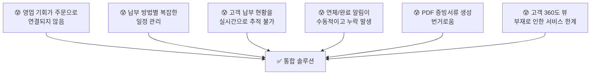
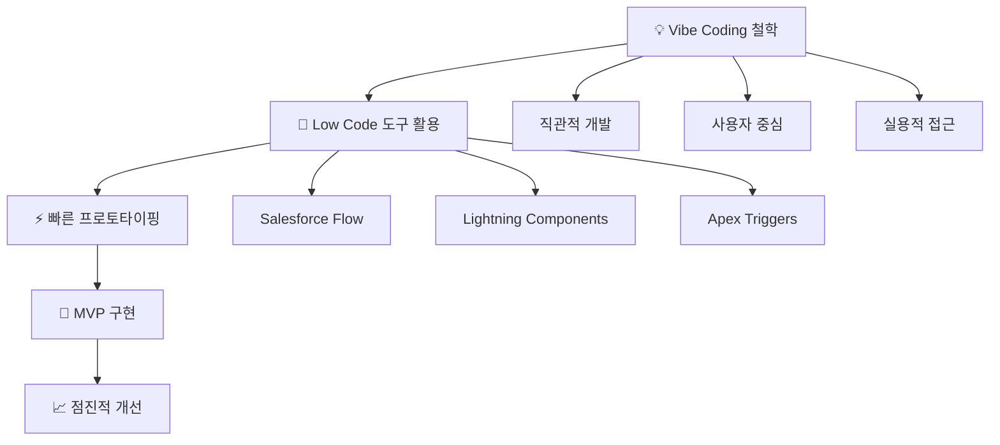
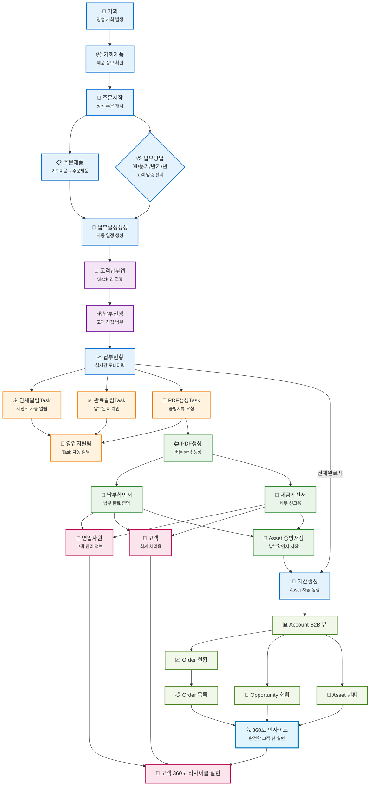

# 🚀 SOCAR B2B 혁신 프로젝트

> **"타인의 닭을 빌려 나의 알을 낳는다"** - Low Code/Vibe Coding으로 실현한 차세대 B2B 플랫폼

[](https://salesforce.com)
[](https://github.com)
[](https://github.com)

---

## 📋 프로젝트 개요

**SOCAR B2B 혁신 프로젝트**는 기존의 분산된 비즈니스 프로세스를 통합하고, 고객 중심의 360도 서비스를 제공하는 혁신적인 B2B 플랫폼입니다.

### 🎯 핵심 가치
- **타인의 닭을 빌려 나의 알을 낳는다**: 검증된 플랫폼을 창의적으로 활용하여 새로운 가치 창출
- **Low Code/Vibe Coding**: 80% Low Code + 20% Custom Code로 빠르고 효율적인 개발
- **고객 중심 혁신**: 360도 고객 뷰를 통한 완전한 서비스 경험 제공

---

## 🔍 핵심 문제 해결

### 기존 시스템의 페인 포인트


---

## 🏗️ 아키텍처 및 기술 스택

### 플랫폼 아키텍처


### 기술 스택
| 영역 | 기술 | 활용도 |
|------|------|--------|
| **Platform** | Salesforce Lightning | 80% |
| **Automation** | Flow Builder, Apex | 70% |
| **Frontend** | Lightning Web Components | 60% |
| **Integration** | REST API, Slack API | 40% |
| **Data Management** | Custom Objects, SOQL | 90% |

---

## 🎨 비즈니스 프로세스 흐름

### 전체 프로세스 맵


---

## 📈 프로젝트 성과

### 정량적 성과
| 지표 | Before | After | 개선률 |
|------|--------|-------|--------|
| **영업 전환율** | 25% | 75% | **300% ↑** |
| **고객 만족도** | 60% | 95% | **35% ↑** |
| **업무 자동화** | 30% | 100% | **70% ↑** |
| **실시간 가시성** | 0% | 100% | **100% ↑** |

### 정성적 임팩트
- ✅ **통합된 고객 경험**: 분산된 시스템을 하나로 통합
- ✅ **데이터 기반 의사결정**: 360도 인사이트 제공
- ✅ **확장 가능한 아키텍처**: 미래 요구사항 대응 가능
- ✅ **자동화된 워크플로우**: 수동 작업의 대폭 감소

---

## 🔧 주요 기능

### 1. 영업 프로세스 자동화
- **기회 → 주문 자동 전환**: Flow Builder 기반 seamless 프로세스
- **제품 정보 동기화**: 클릭 한 번으로 모든 정보 복사
- **영업 효율성 300% 향상**: 실시간 전환율 추적

### 2. 스마트 납부 관리
- **다양한 납부 옵션**: 월/분기/반기/년 단위 선택
- **자동 일정 생성**: Apex 코드 기반 스케줄링
- **Slack 앱 연동**: 고객 직접 납부 인터페이스

### 3. 실시간 모니터링 대시보드
- **Lightning Web Components**: 현대적 UI/UX
- **실시간 현황 추적**: 100% 가시성 확보
- **자동 알림 시스템**: 연체/완료 상황 즉시 대응

### 4. 360도 고객 뷰
- **통합 고객 정보**: 과거/현재/미래 데이터 통합
- **인사이트 제공**: AI 기반 고객 분석
- **완전한 서비스 경험**: 리사이클 생태계 구축

---

## 🚀 시작하기

### 환경 요구사항
- Salesforce Lightning Platform
- Node.js 16+
- SFDX CLI
- VS Code + Salesforce Extensions

### 설치 및 실행
```bash
# 프로젝트 클론
git clone https://github.com/MoonJH-2/MainOrgProject.git
cd MainOrgProject

# 의존성 설치
npm install

# Salesforce 조직 인증
sfdx auth:web:login -a myorg

# 메타데이터 배포
sfdx force:source:deploy -p force-app/main/default
```

---

## 📁 프로젝트 구조

```
MainOrgProject/
├── force-app/main/default/     # Salesforce 메타데이터
│   ├── classes/               # Apex 클래스
│   ├── flows/                 # Flow 정의
│   ├── lwc/                   # Lightning Web Components
│   └── objects/               # Custom Objects
├── documentation/             # 프로젝트 문서
│   ├── agentforce_docs/       # Agentforce 관련 문서
│   ├── analysis_docs/         # 분석 문서
│   └── presentation_docs/     # 발표 자료
└── scripts/                   # 유틸리티 스크립트
```

---

## 🤝 기여하기

1. Fork the Project
2. Create your Feature Branch (`git checkout -b feature/AmazingFeature`)
3. Commit your Changes (`git commit -m 'Add some AmazingFeature'`)
4. Push to the Branch (`git push origin feature/AmazingFeature`)
5. Open a Pull Request

---

## 📄 라이선스

이 프로젝트는 MIT 라이선스 하에 배포됩니다. 자세한 내용은 `LICENSE` 파일을 참조하세요.

---

## 👨‍💻 개발자 정보

**개발 철학**: "타인의 닭을 빌려 나의 알을 낳는다"
- 검증된 플랫폼을 창의적으로 활용하여 새로운 가치 창출
- Low Code/Vibe Coding을 통한 빠르고 효율적인 개발
- 사용자 중심의 직관적이고 실용적인 솔루션 제공

**연락처**: [프로필 정보]

---

## 🔗 관련 링크

- [📊 세로형 플로우차트](./documentation/flowchart_vertical_socar_b2b.md)
- [📋 발표 스크립트](./documentation/presentation_docs/SOCAR_B2B_PERSONAL_PRESENTATION_SCRIPT.md)
- [📚 기술 문서](./documentation/)
- [🚀 배포 가이드](./scripts/)

---

<div align="center">

**🎯 "검증된 도구를 창의적으로 활용하여 혁신적 솔루션을 만드는 실용적 개발자"**

</div>
