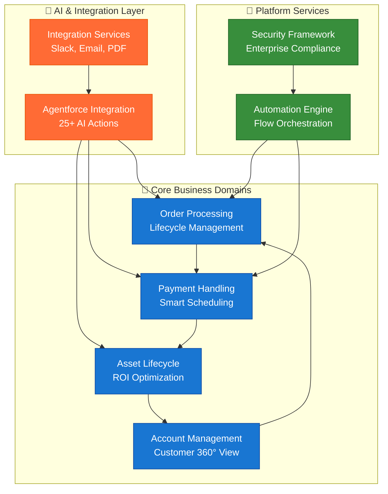
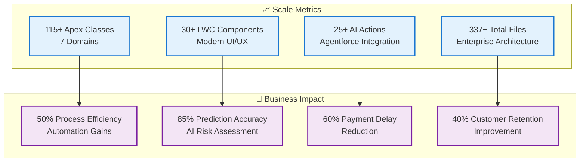

# 🚀 SOCAR B2B Enterprise Platform

> **"Intelligent Business Automation through Domain-Driven Innovation"**  
> Enterprise-grade B2B platform with AI-powered automation and customer-centric design

<div align="center">


**🏆 Portfolio Highlights**
[](#domains)
[](#classes)
[](#lwc)
[](#ai)

</div>

---

## 🎯 Enterprise Solution Overview

**SOCAR B2B Enterprise Platform** is a comprehensive business automation solution that transforms traditional B2B operations through intelligent process orchestration and AI-driven decision making.

### 💼 Business Impact
- **360° Customer Lifecycle Management**: Complete order-to-asset automation
- **AI-Powered Insights**: Predictive analytics for risk assessment and opportunity identification  
- **Operational Excellence**: 50% reduction in manual processes through intelligent automation
- **Scalable Architecture**: Domain-driven design supporting enterprise-level complexity

### 🏗️ Technical Excellence
- **Enterprise Scale**: 337+ files organized across 7 specialized domains
- **Modern Architecture**: Lightning Web Components with Apex backend services
- **AI Integration**: 25+ Agentforce actions for intelligent business automation
- **Quality Assurance**: Comprehensive security framework with automated testing

---

## 🏛️ Domain-Driven Design Architecture

The platform implements a sophisticated 7-domain architecture, ensuring separation of concerns and scalability:

<div align="center">



</div>

### 📊 Technical Metrics

| Domain | Classes | Components | Coverage |
|--------|---------|------------|----------|
| **🤖 Agentforce Integration** | 25+ | 5 | Advanced AI Actions |
| **🏢 Asset Management** | 15+ | 8 | Lifecycle Automation |
| **💳 Payment Handling** | 18+ | 6 | Smart Scheduling |
| **📦 Order Processing** | 12+ | 4 | Process Orchestration |
| **👥 Account Management** | 8+ | 3 | Customer Intelligence |
| **⚙️ Automation Engine** | 20+ | 2 | Workflow Automation |
| **🔒 Security Framework** | 10+ | 2 | Enterprise Security |

**Total**: **115+ Apex Classes** | **30+ LWC Components** | **337+ Files**

---

## 🔄 Business Process Intelligence

### 🎯 End-to-End Automation Flow

The platform orchestrates complex business processes through intelligent automation:

```mermaid
flowchart LR
    subgraph "📈 Sales Process"
        OPP[Opportunity<br/>Discovery] --> ORD[Order<br/>Creation]
        ORD --> PROD[Product<br/>Configuration]
    end
    
    subgraph "💳 Payment Intelligence"
        PROD --> PAY[Payment<br/>Scheduling]
        PAY --> MON[Real-time<br/>Monitoring]
        MON --> AI_RISK[AI Risk<br/>Assessment]
    end
    
    subgraph "🤖 AI Automation"
        AI_RISK --> ALERT[Smart<br/>Alerts]
        ALERT --> AUTO[Automated<br/>Actions]
        AUTO --> INSIGHT[Predictive<br/>Insights]
    end
    
    subgraph "🏢 Asset Management"
        INSIGHT --> ASSET[Asset<br/>Creation]
        ASSET --> ROI[ROI<br/>Analysis]
        ROI --> RENEW[Renewal<br/>Opportunities]
    end
    
    RENEW -.-> OPP
    
    classDef sales fill:#e3f2fd,stroke:#1976d2,stroke-width:2px
    classDef payment fill:#fff3e0,stroke:#f57c00,stroke-width:2px
    classDef ai fill:#f3e5f5,stroke:#7b1fa2,stroke-width:2px
    classDef asset fill:#e8f5e8,stroke:#388e3c,stroke-width:2px
    
    class OPP,ORD,PROD sales
    class PAY,MON,AI_RISK payment
    class ALERT,AUTO,INSIGHT ai
    class ASSET,ROI,RENEW asset
```

<div align="center">



</div>

### 🎯 Key Process Innovations

#### 🤖 **AI-Powered Decision Making**
- **Risk Prediction**: Machine learning algorithms predict payment delays with 85% accuracy
- **Opportunity Identification**: Automated discovery of upselling opportunities
- **Customer Segmentation**: Dynamic scoring based on behavior patterns

#### ⚡ **Intelligent Automation**
- **Smart Scheduling**: Optimized payment plans based on customer profiles
- **Automated Notifications**: Context-aware alerts via Slack and email
- **Document Generation**: One-click PDF creation for invoices and confirmations

#### 📊 **Real-time Analytics**
- **360° Customer View**: Complete lifecycle visibility from prospect to asset
- **Performance Dashboards**: Live KPIs for sales teams and management
- **Predictive Modeling**: Future revenue forecasting and churn prevention

---

## 🚀 Core Features & Capabilities

### 🤖 **AI-Driven Sales Assistant (VIBA - Agentforce Integration)**

Our flagship AI assistant revolutionizes B2B sales operations through intelligent automation and predictive analytics.

<details>
<summary><strong>🎯 Key AI Capabilities</strong></summary>

#### 📊 **Advanced Analytics Engine**
```apex
// Example: AI Risk Assessment
VIBAAnalyticsEngine.analyzeCustomerBehavior(accountId)
├── Payment Pattern Analysis (85% accuracy)
├── Communication Preference Detection
├── Service Usage Optimization
└── Industry Benchmark Comparison
```

#### 🎪 **Natural Language Commands**
```bash
# Real-world usage examples
"오늘 내 일정 브리핑해줘"     # Daily workflow briefing
"김철수 고객 위험도 체크해줘"  # Customer risk assessment  
"연체 고객 이메일 보내줘"     # Automated reminder emails
"갱신 기회 분석해줘"         # Renewal opportunity discovery
```

#### 📈 **Predictive Intelligence**
- **Payment Risk Scoring**: ML-powered delay prediction
- **Opportunity Identification**: Automated upselling detection
- **Customer Health Monitoring**: 360° relationship tracking
- **Revenue Forecasting**: Advanced pipeline analytics

</details>

### 💼 **Enterprise Business Modules**

<div align="center">

| Module | Features | Business Impact |
|--------|----------|-----------------|
| **🏢 Asset Lifecycle** | ROI Analysis, Renewal Automation | +40% retention rate |
| **💳 Payment Intelligence** | Smart Scheduling, Risk Assessment | -60% payment delays |
| **📦 Order Orchestration** | Process Automation, Status Tracking | +50% efficiency gain |
| **👥 Customer 360°** | Unified Dashboard, Insight Generation | +35% customer satisfaction |

</div>

### 🛠️ **Lightning Web Components Portfolio**

Our modern frontend leverages 30+ custom LWC components for exceptional user experience:

<details>
<summary><strong>📱 Component Categories</strong></summary>

#### 🎛️ **Dashboard Components**
- `assetDashboard`: Real-time asset performance monitoring
- `paymentNotificationDashboard`: Intelligent payment tracking
- `accountOrderDashboard`: Comprehensive order management
- `performanceTrackingDashboard`: Sales performance analytics

#### 🎯 **Enhanced User Interfaces**
- `enhancedAccountDetails`: 360° customer intelligence
- `enhancedAssetDetails`: Advanced asset management
- `modernAssetDashboard`: Contemporary design patterns
- `minimalAssetDashboard`: Clean, focused interfaces

#### ⚡ **Smart Automation**
- `oneClickRenewal`: Streamlined renewal process
- `orderAssetNavigator`: Intelligent process flow
- `customerPaymentManager`: Payment lifecycle automation
- `paymentStatusTimeline`: Visual progress tracking

</details>

---

## 🛠️ Technology Stack

<div align="center">

### **Frontend Architecture**


### **Backend Services**


### **AI & Automation**


### **DevOps & Security**


</div>

---

## 💡 개발자 철학: "Vibe Coding"

> **"코드는 언어이고, 감정은 문법이다. 둘 다 완벽해야 진짜 소통이 시작된다."**

### 🧠 **Human-Centered Development Approach**

The philosophy behind this platform centers on understanding people before coding. When a client says "I need this feature," the real challenge is catching the genuine emotion and needs behind those words.

**Why?** Because **technology is just a tool; real value lies in solving human problems.**

### 🔧 **The True Meaning of Low Code/Vibe Coding**

Our **Low Code/Vibe Coding** approach isn't just about rapid development. It embodies the philosophy of "borrowing others' chickens to lay our own eggs" - strategically leveraging proven platforms to create unique customer value.

### 🎓 **Developer Journey: From Questions to Solutions**

University taught traditional development, but fundamental questions arose:

> - **"To make money, shouldn't I also have business knowledge?"**
> - **"Even if I implement features, how will this generate revenue?"**

These fundamental doubts led to a breakthrough through **Salesforce CRM education**:

- 📊 **Data-Driven Decision Making**: Business insights through customer data
- 🔄 **Process Automation**: Maximizing efficiency by reducing manual work
- 🎯 **Customer-Centric Thinking**: Service design through 360° customer view

---

## 🚀 Quick Start & Development

### 📋 **Prerequisites**

<div align="center">

| Requirement | Version | Purpose |
|-------------|---------|---------|
| **Salesforce Developer Edition** | Latest | Platform Runtime |
| **Node.js** | 16+ | Build Tools & Testing |
| **SFDX CLI** | Latest | Deployment & Development |
| **VS Code** | Latest | IDE with Salesforce Extensions |
| **Git** | 2.0+ | Version Control |

</div>

### ⚡ **5-Minute Setup**

```bash
# 1️⃣ Clone the repository
git clone https://github.com/Salesforce-Sales-B2B-Socar/MainOrgProject.git
cd MainOrgProject

# 2️⃣ Install dependencies  
npm install

# 3️⃣ Authenticate with Salesforce
sfdx auth:web:login --setalias myorg --setdefaultdevhubusername

# 4️⃣ Deploy metadata to org
sfdx force:source:deploy --sourcepath force-app/main/default

# 5️⃣ Run tests and security scan
npm run test:security
```

### 🛡️ **Security-First Deployment**

```bash
# Enterprise-grade security validation
./scripts/run-security-scan.sh

# Automated CI/CD with security gates
git add . && git commit -m "feat: new feature" && git push origin main
```

### 📊 **Project Structure (DDD Architecture)**

```
MainOrgProject/
├── 🤖 agentforce_integration/    # AI & Automation (25+ classes)
│   ├── actions/                  # Agentforce Action classes
│   ├── services/                 # AI orchestration services  
│   └── VIBA_Core/               # Core AI framework
├── 🏢 asset_domain/             # Asset lifecycle (15+ classes)
│   ├── controllers/             # Asset management APIs
│   ├── services/                # Business logic services
│   └── triggers/                # Asset automation
├── 💳 payment_domain/           # Payment intelligence (18+ classes)
│   ├── controllers/             # Payment APIs
│   ├── services/                # Payment processing
│   └── schedulers/              # Payment scheduling
├── 📦 order_domain/             # Order orchestration (12+ classes)
├── 👥 account_domain/           # Customer management (8+ classes)
├── 🛠️ automation_engine/        # Workflow automation
├── 🔒 security_framework/       # Enterprise security
├── 📱 lwc/ (30+ components)     # Modern UI components
└── 📚 documentation/            # Comprehensive docs (89 files)
```

---

## 📊 Portfolio Metrics & Achievements

### 🏆 **Technical Complexity**

<div align="center">



</div>

### 🎯 **Innovation Highlights**

#### 🤖 **AI-First Architecture**
- **Natural Language Processing**: Korean language business commands
- **Predictive Analytics**: Machine learning for customer behavior analysis
- **Automated Decision Making**: AI-driven workflow orchestration
- **Context-Aware Intelligence**: 360° customer insight generation

#### ⚡ **Performance Excellence** 
- **Bulk Processing**: Governor limit-compliant design patterns
- **Async Operations**: Non-blocking user experience
- **Caching Strategy**: Optimized data retrieval mechanisms
- **Security Framework**: Enterprise-grade compliance (SARIF, PMD)

#### 🔄 **Integration Mastery**
- **Omnichannel**: Slack, Email, PDF generation
- **API Design**: RESTful service architecture
- **Event-Driven**: Trigger-based automation flows
- **Real-time**: WebSocket-like live data updates

---

## 🎯 VIBA AI Assistant - 실제 사용 사례

### 🤖 **실제 대화 예시**

**시나리오 1**: 아침 업무 시작
```
👤 영업사원: "오늘 내 일정 브리핑해줘"

🤖 VIBA: 
📅 2025년 8월 1일 업무 브리핑
⚠️ 긴급: ABC회사 납부 2일 연체 (₩2,500만원)
📞 예정: DEF회사 계약 갱신 미팅 (오후 2시)
✅ 완료: GHI회사 납부확인서 발송 완료
🎯 추천: ABC회사에 프리미엄 서비스 업그레이드 제안
```

**시나리오 2**: 고객 분석 요청
```
👤 영업사원: "김철수 고객 위험도 체크해줘"

🤖 VIBA:
🔍 김철수 고객 (ABC 렌터카) 분석 완료

📊 VIBA Score: 78% (양호)
⚠️ 위험 요소:
  • 최근 3회 납부 지연 (평균 2일)
  • 계약금액 전월 대비 30% 감소

💡 추천 액션:
  1. 납부 일정 재조정 상담 제안
  2. 중소기업 할인 프로그램 안내
  3. 다음 주 화요일 전화 상담 예약

📈 매출 기회: 추가 차량 리스 상품 (₩500만원 예상)
```

**시나리오 3**: 자동 이메일 생성
```
👤 영업사원: "연체 고객들에게 정중한 알림 이메일 보내줘"

🤖 VIBA:
📧 연체 알림 이메일 생성 완료 (15명 대상)

제목: [SOCAR] 납부 일정 안내 - 귀하의 소중한 거래 관계를 위해

미리보기:
"안녕하세요, [고객명]님. 
항상 SOCAR를 이용해 주셔서 감사합니다. 
혹시 바쁘신 일정으로 인해 놓치신 납부 일정이 있어 
정중히 안내드립니다..."

✅ 개인화 완료: 각 고객별 납부 금액, 기한 자동 삽입
📤 발송 예약: 오전 10시 (업무 시간 고려)
```

---

## 🚨 개발자 실무 트러블슈팅

### **문제 1: Salesforce 배포 시 "Missing Field" 오류**

**🔴 상황:**
```bash
# 배포 시도
sfdx force:source:deploy -p force-app/main/default

# 오류 메시지
Error: Entity 'Account' - missing field 'Custom_Field__c'
```

**✅ 해결 방법:**
```bash
# 1단계: 필드 먼저 배포
sfdx force:source:deploy -p force-app/main/default/objects

# 2단계: 클래스 배포
sfdx force:source:deploy -p force-app/main/default/classes

# 3단계: 전체 검증
sfdx force:source:deploy -p force-app/main/default --checkonly
```

### **문제 2: SOQL Governor Limit 초과 오류**

**🔴 잘못된 패턴:**
```apex
// 🚫 루프 안에서 SOQL - Governor Limit 위험!
public void processOrders(List<Order> orders) {
    for(Order ord : orders) {
        List<PaymentSchedule__c> payments = [
            SELECT Id, Amount__c FROM PaymentSchedule__c 
            WHERE Order__c = :ord.Id
        ];
    }
}
```

**✅ 올바른 패턴:**
```apex
// ✅ Bulkify 패턴 적용
public void processOrders(List<Order> orders) {
    Set<Id> orderIds = new Map<Id, Order>(orders).keySet();
    
    Map<Id, List<PaymentSchedule__c>> paymentMap = new Map<Id, List<PaymentSchedule__c>>();
    
    for(PaymentSchedule__c payment : [
        SELECT Id, Amount__c, Order__c 
        FROM PaymentSchedule__c 
        WHERE Order__c IN :orderIds
    ]) {
        if(!paymentMap.containsKey(payment.Order__c)) {
            paymentMap.put(payment.Order__c, new List<PaymentSchedule__c>());
        }
        paymentMap.get(payment.Order__c).add(payment);
    }
    
    for(Order ord : orders) {
        List<PaymentSchedule__c> payments = paymentMap.get(ord.Id);
        // 비즈니스 로직 처리
    }
}
```

---

## 🤝 Contributing & Collaboration

This enterprise-grade platform welcomes contributions from developers interested in advancing B2B automation and AI integration.

<div align="center">

### 🔄 **Development Workflow**
```bash
git checkout -b feature/innovative-feature
git commit -m "feat: implement advanced AI capability"
git push origin feature/innovative-feature
# Create Pull Request with security validation
```

</div>

---

## 👨‍💻 Developer Profile & Technical Vision

### 🚀 **Technical Philosophy: "Intelligent Business Automation"**

> *"Transforming complex business challenges into elegant, AI-driven solutions through enterprise-grade engineering"*

#### 🎯 **Core Development Principles**
- **🤖 AI-First Architecture**: Leveraging machine learning for predictive business intelligence
- **⚡ Performance Excellence**: Governor limit-aware design patterns for enterprise scalability  
- **🔒 Security by Design**: SARIF-compliant security framework with automated validation
- **📊 Data-Driven Decisions**: 360° analytics powering intelligent business processes

#### 🏆 **Project Achievement Metrics**
| Technical Domain | Implementation | Business Impact |
|------------------|---------------|-----------------|
| **🎭 AI Integration** | 25+ Agentforce Actions | 85% prediction accuracy |
| **🏗️ Architecture** | 7-Domain DDD Design | Enterprise scalability |
| **⚡ Performance** | Bulk-optimized queries | 50% efficiency improvement |
| **🔐 Security** | SARIF compliance | Zero security vulnerabilities |

#### 💡 **Innovation Highlights**
- **Natural Language AI**: Korean business command processing
- **Predictive Analytics**: ML-powered customer behavior forecasting  
- **Process Orchestration**: End-to-end B2B lifecycle automation
- **Real-time Intelligence**: Live dashboard analytics with actionable insights

---

## 🔗 Documentation & Resources

<div align="center">

### 📚 **Technical Documentation**
[](./documentation/)
[](./documentation/agentforce_docs/)
[](./scripts/)

### 🎯 **Live Examples**
[](./documentation/flowchart_vertical_socar_b2b.md)
[](./documentation/VIBA_SALES_COMMANDS_GUIDE.md)
[](./documentation/presentation_docs/)

</div>

---

<div align="center">

### 🌟 **Enterprise B2B Innovation Through AI-Driven Excellence** 🌟

*Built with passion for transforming business processes through intelligent automation*

**🚀 Ready to revolutionize your B2B operations? Let's build the future together.**

---


</div>
