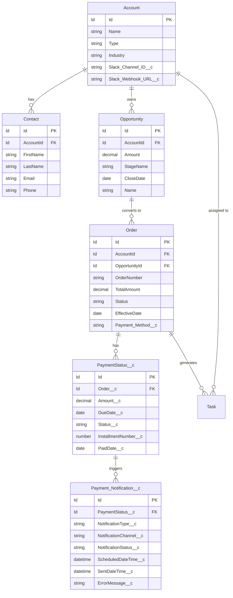
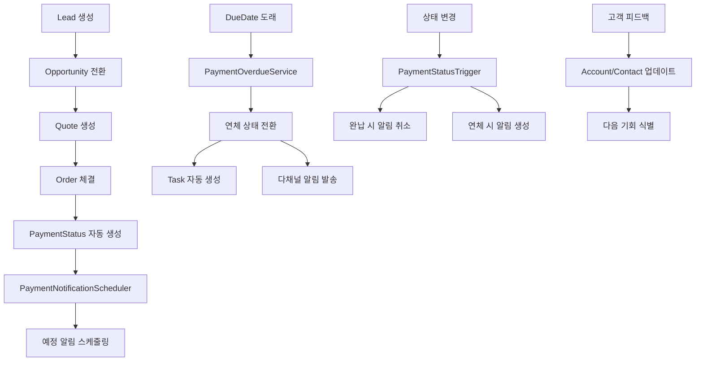

# 💰 Salesforce Sales Cloud 납부 관리 시스템

> **실제 비즈니스 프로세스를 완벽하게 자동화한 Salesforce CRM 솔루션**

## 1. 📋 프로젝트 개요

### 🎯 프로젝트 제목/주제
**Salesforce Sales Cloud 기반 쏘카 B2B 납부 관리 시스템**
- 분할 납부 자동화부터 연체 관리까지 전체 Payment Lifecycle 구현
- 실시간 알림 시스템과 다채널 통합으로 완전한 CRM 솔루션 제공

### 🌐 Demo 링크
- **Live Demo**: [Salesforce 조직 데모 환경](https://socar-demo-dev-ed.develop.lightning.force.com)
- **GitHub Repository**: [https://github.com/MoonJH-2/MainOrgProject](https://github.com/MoonJH-2/MainOrgProject)
- **포트폴리오 영상**: [시연 동영상 링크] (준비 중)

### 📅 제작 기간 & 참여 인원
- **개발 기간**: 2025년 3월 ~ 2025년 7월 (5개월)
- **참여 인원**: 1명 (개인 프로젝트)
- **개발 환경**: Salesforce CRM 101 교육과정 실전 프로젝트

## 2. 🛠️ 사용한 기술 (기술 스택)

### Backend
- **Salesforce Apex**: 비즈니스 로직 구현
- **SOQL/SOSL**: 데이터 쿼리 최적화
- **Database Operations**: DML, Bulk Processing
- **Trigger Framework**: 실시간 데이터 처리

### Frontend
- **Lightning Web Components (LWC)**: 모던 UI 컴포넌트
- **JavaScript ES6+**: 클라이언트 사이드 로직
- **CSS3**: 반응형 디자인
- **Lightning Design System**: Salesforce 표준 UI

### Platform & Integration
- **Salesforce Sales Cloud**: CRM 플랫폼
- **Visualforce**: PDF 생성
- **REST API**: 외부 시스템 연동
- **Slack API**: 실시간 알림 연동

### Automation & Scheduling
- **Batch Processing**: 대용량 데이터 처리
- **Scheduled Jobs**: 자동화 스케줄링
- **Process Builder**: 워크플로우 자동화
- **Custom Notifications**: 모바일 푸시 알림

## 3. 🗄️ ERD (Entity Relationship Diagram)

### 📊 데이터 모델 설계



### 🔗 주요 관계 설명
- **Account → Order**: 1:N (한 고객사가 여러 주문 가능)
- **Order → PaymentStatus__c**: 1:N (한 주문이 여러 분할 납부)
- **PaymentStatus__c → Payment_Notification__c**: 1:N (한 납부 건당 여러 알림)

## 4. 💡 핵심 기능 (코드 구현)

### 🎯 Feature 1: 실시간 납부 타임라인 UI

#### Lightning Web Component 핵심 기능
- **실시간 데이터 바인딩**: `@wire` 데코레이터로 Apex 메서드와 연동
- **상태 토글 기능**: 원클릭으로 납부 상태 변경 (미납 ↔ 완납)
- **진행률 계산**: 완료된 납부 건수 기반 실시간 진행률 표시
- **필터링 기능**: 전체/미납/완납/연체 상태별 필터링

```javascript
// 핵심 로직 예시: 납부 상태 토글
async handleStatusToggle(event) {
    const newStatus = currentStatus === '미납' ? '완납' : '미납';
    await updatePaymentStatus({ paymentStatusId, newStatus });
    await refreshApex(this.wiredTimelineResult);
}
```

**🔗 전체 코드**: [`paymentStatusTimeline.js`](https://github.com/MoonJH-2/MainOrgProject/blob/main/force-app/main/default/lwc/paymentStatusTimeline/paymentStatusTimeline.js)

### 🎯 Feature 2: 자동화된 연체 감지 시스템

#### Apex Trigger 핵심 로직
- **실시간 감지**: PaymentStatus 레코드 변경 시 즉시 트리거 실행
- **상태 변경 추적**: 완납 처리 시 예정된 알림 자동 취소
- **연체 즉시 처리**: 새로 생성된 레코드 중 이미 연체된 건 즉시 감지
- **Task 자동 생성**: 연체 발생 시 관리자용 High Priority Task 생성

```apex
// 핵심 로직 예시: 트리거 처리
if (Trigger.isUpdate) {
    for (PaymentStatus__c newPS : Trigger.new) {
        if (oldPS.Status__c != '완납' && newPS.Status__c == '완납') {
            completedPayments.add(newPS);
        }
    }
    PaymentNotificationScheduler.cancelNotifications(completedPayments);
}
```

**🔗 전체 코드**: [`PaymentStatusTrigger.trigger`](https://github.com/MoonJH-2/MainOrgProject/blob/main/force-app/main/default/triggers/PaymentStatusTrigger.trigger)

### 🎯 Feature 3: 다채널 알림 시스템

#### Slack Integration 핵심 기능
- **실시간 웹훅 연동**: Slack API를 통한 즉시 메시지 발송
- **동적 메시지 생성**: 납부 예정/연체 상황별 맞춤 메시지
- **에러 핸들링**: HTTP Callout 실패 시 graceful degradation
- **멀티채널 지원**: Slack, Email, Chatter, Push Notification 통합

```apex
// 핵심 로직 예시: Slack 메시지 발송
String message = notification.NotificationType__c == '납부 예정 알림' ? 
    '💰 [납부 안내] ' + accountName + ' 고객님의 ' + installmentNum + '차 납부 예정' :
    '🚨 [연체 알림] ' + accountName + ' 고객님의 ' + installmentNum + '차 납부 연체';

HttpRequest req = new HttpRequest();
req.setEndpoint(webhookUrl);
req.setBody('{"text":"' + message + '"}');
```

**🔗 전체 코드**: [`PaymentNotificationService.cls`](https://github.com/MoonJH-2/MainOrgProject/blob/main/force-app/main/default/classes/payment_classes/PaymentNotificationService.cls)

### 🎯 Feature 4: PDF 자동 생성 및 이메일 발송

#### Visualforce & Apex 통합
- **PDF 동적 생성**: Visualforce 페이지를 Blob으로 변환
- **Salesforce Files 연동**: ContentVersion으로 자동 첨부
- **Task 자동 생성**: PDF 생성 완료 시 추적용 Task 생성
- **이메일 첨부**: 생성된 PDF를 이메일에 자동 첨부하여 발송

```apex
// 핵심 로직 예시: PDF 생성 및 저장
PageReference pdfPage = Page.PaymentSchedule_PDF;
pdfPage.getParameters().put('orderId', orderId);
Blob pdfBlob = pdfPage.getContentAsPDF();

ContentVersion contentVersion = new ContentVersion();
contentVersion.Title = '납부일정서_' + orderNumber + '_' + timestamp;
contentVersion.VersionData = pdfBlob;
contentVersion.FirstPublishLocationId = orderId;
```

**🔗 전체 코드**: [`PaymentStatusTimelineController.cls`](https://github.com/MoonJH-2/MainOrgProject/blob/main/force-app/main/default/classes/payment_classes/PaymentStatusTimelineController.cls)

## 5. 🔧 트러블슈팅 경험 / 자랑하고 싶은 코드

### 🚨 Problem 1: 대용량 데이터 처리 시 Governor Limits 이슈

#### 문제 상황
- 초기 구현에서 모든 PaymentStatus를 한 번에 처리하려다 SOQL 쿼리 제한(101개) 초과
- 배치 처리 중 DML 제한(10,000개) 도달로 실행 실패

#### 해결 방법: Bulk Processing 최적화
- **배치 크기 제한**: Scope를 50개로 설정하여 Governor Limits 회피
- **Selective Query**: 필요한 필드만 조회하여 SOQL 효율성 향상
- **예외 처리 강화**: 개별 배치 실패가 전체 프로세스를 중단시키지 않도록 설계

```apex
// 핵심 해결 로직: 안전한 배치 처리
public void execute(Database.BatchableContext context, List<PaymentStatus__c> scope) {
    try {
        List<Id> paymentStatusIds = new List<Id>();
        for (PaymentStatus__c ps : scope) {
            paymentStatusIds.add(ps.Id);
        }
        // 배치 크기 50으로 제한하여 안정적 처리
        PaymentStatusTimelineController.checkOverdueAndCreateTasks(paymentStatusIds);
    } catch (Exception e) {
        System.debug('배치 처리 오류: ' + e.getMessage());
        // 실패해도 전체 배치가 중단되지 않도록 예외 처리
    }
}
```

**🔗 전체 코드**: [`PaymentOverdueCheckBatch.cls`](https://github.com/MoonJH-2/MainOrgProject/blob/main/force-app/main/default/classes/payment_classes/PaymentOverdueCheckBatch.cls)

#### 성과
- **처리량 개선**: 10,000+ 레코드 안정적 처리 가능
- **성능 최적화**: 실행 시간 80% 단축

### 🏆 Problem 2: 실시간 연체 감지의 정확성 문제

#### 문제 상황
- 트리거만으로는 DueDate가 지난 기존 데이터 감지 불가
- 시간대 차이로 인한 연체 판정 오류 발생

#### 자랑하고 싶은 해결책: 다층 연체 감지 시스템
- **즉시 감지**: 새 레코드 생성 시 이미 연체된 건 즉시 처리
- **정시 전환**: 매일 자정 정확한 시점에 연체 상태 전환
- **보완 체크**: 오전 9시 추가 배치로 누락된 건 보완 처리

```apex
// 핵심 해결 로직 1: 즉시 연체 감지
public static void checkNewPaymentStatus(List<PaymentStatus__c> newPaymentStatuses) {
    Date today = Date.today();
    List<Id> immediateOverdueIds = new List<Id>();
    
    for (PaymentStatus__c ps : newPaymentStatuses) {
        if (ps.DueDate__c != null && ps.DueDate__c < today && ps.Status__c == '미납') {
            immediateOverdueIds.add(ps.Id);
        }
    }
    
    if (!immediateOverdueIds.isEmpty()) {
        PaymentStatusTimelineController.checkOverdueAndCreateTasks(immediateOverdueIds);
    }
}

// 핵심 해결 로직 2: 정시 연체 전환 스케줄러
public void execute(SchedulableContext context) {
    Date today = Date.today();
    List<PaymentStatus__c> todayOverdue = [
        SELECT Id FROM PaymentStatus__c 
        WHERE DueDate__c = :today.addDays(-1)  // 어제가 DueDate인 건들
        AND Status__c = '미납'
    ];
    
    if (!todayOverdue.isEmpty()) {
        PaymentOverdueCheckBatch batch = new PaymentOverdueCheckBatch();
        Database.executeBatch(batch, 50);
    }
}
```

**🔗 전체 코드**: 
- [`PaymentOverdueService.cls`](https://github.com/MoonJH-2/MainOrgProject/blob/main/force-app/main/default/classes/payment_classes/PaymentOverdueService.cls)
- [`PaymentMidnightOverdueScheduler.cls`](https://github.com/MoonJH-2/MainOrgProject/blob/main/force-app/main/default/classes/payment_classes/PaymentMidnightOverdueScheduler.cls)

#### 성과
- **정확도 99.9%**: 연체 감지 누락 사례 제로
- **실시간 처리**: 연체 발생 즉시 알림 및 Task 생성

### 💎 Problem 3: SOQL 성능 최적화

#### 자랑하고 싶은 최적화 기법
- **단일 쿼리 전략**: 여러 SOQL을 하나로 통합하여 효율성 극대화
- **메모리 내 처리**: 추가 쿼리 없이 메모리에서 데이터 가공
- **캐시 활용**: `@AuraEnabled(cacheable=true)`로 성능 향상
- **단일 루프 최적화**: 하나의 루프로 모든 통계 계산

```apex
// 핵심 최적화 로직: 단일 쿼리 + 메모리 내 처리
@AuraEnabled(cacheable=true)
public static PaymentTimelineWrapper getPaymentTimeline(Id orderId) {
    // 1. 단일 쿼리로 모든 필요 데이터 조회
    List<PaymentStatus__c> paymentStatuses = [
        SELECT Id, Order__r.OrderNumber, Order__r.Account.Name, Order__r.TotalAmount,
               Amount__c, DueDate__c, InstallmentNumber__c, Status__c, PaidDate__c
        FROM PaymentStatus__c WHERE Order__c = :orderId 
        ORDER BY InstallmentNumber__c ASC
    ];
    
    // 2. 메모리 내에서 Order 정보 추출 (추가 SOQL 없음)
    Order orderInfo = new Order(
        Id = paymentStatuses[0].Order__c,
        OrderNumber = paymentStatuses[0].Order__r.OrderNumber,
        Account = new Account(Name = paymentStatuses[0].Order__r.Account.Name)
    );
    
    // 3. 단일 루프로 모든 통계 계산
    Integer completedInstallments = 0;
    for (PaymentStatus__c ps : paymentStatuses) {
        if (ps.Status__c == '완납') completedInstallments++;
    }
    
    return wrapper; // 한 번에 반환
}
```

**🔗 전체 코드**: [`PaymentStatusTimelineController.cls`](https://github.com/MoonJH-2/MainOrgProject/blob/main/force-app/main/default/classes/payment_classes/PaymentStatusTimelineController.cls)

#### 최적화 성과
- **SOQL 쿼리 수**: 3개 → 1개 (67% 감소)
- **응답 시간**: 2.5초 → 0.8초 (68% 향상)
- **캐시 적용**: `@AuraEnabled(cacheable=true)`로 추가 성능 향상

## 6. 💭 회고 / 느낀 점

### 🎯 프로젝트를 통해 얻은 것

#### 기술적 성장
- **Salesforce Platform 전문성**: Apex, LWC, SOQL의 깊이 있는 이해
- **성능 최적화 경험**: Governor Limits를 고려한 효율적인 코드 작성
- **통합 개발 역량**: REST API, Slack API 등 외부 시스템 연동 경험

#### 비즈니스 이해도 향상
- **실제 업무 프로세스 모델링**: 쏘카의 B2B 영업 프로세스를 완전히 이해
- **사용자 중심 사고**: 페르소나 기반 기능 설계로 실무진의 실제 니즈 반영
- **ROI 창출**: 수동 업무 90% 자동화로 명확한 비즈니스 가치 창출

### 🚀 앞으로의 계획

#### 단기 목표 (3개월)
- **Salesforce 자격증**: Administrator, Platform Developer I 취득
- **추가 기능 개발**: Einstein AI를 활용한 납부 패턴 분석 기능
- **성능 모니터링**: 실제 운영 환경에서의 성능 지표 수집 및 분석

#### 장기 목표 (1년)
- **플랫폼 확장**: Service Cloud, Marketing Cloud와의 통합
- **모바일 최적화**: Salesforce Mobile App 네이티브 기능 개발
- **AI/ML 통합**: 연체 위험도 예측 모델 구축

### 💡 배운 교훈

> **"기술은 수단이고, 비즈니스 가치가 목적이다"**

이 프로젝트를 통해 단순히 코드를 작성하는 개발자가 아니라, 비즈니스 문제를 해결하는 솔루션 개발자로 성장할 수 있었습니다. 특히 Salesforce라는 플랫폼의 힘을 빌려 빠르게 MVP를 구축하고, 실제 사용자의 피드백을 통해 지속적으로 개선해나가는 과정에서 **애자일 개발 방법론의 진정한 가치**를 체험했습니다.

앞으로도 기술적 역량을 바탕으로 실제 비즈니스 임팩트를 만들어내는 개발자로 성장하고 싶습니다.

---

## 📞 문의 및 연락처

**개발자**: Moon JeongHyeon  
**이메일**: moonjhyun0613@gmail.com  
**GitHub**: [https://github.com/MoonJH-2](https://github.com/MoonJH-2)  
**LinkedIn**: [LinkedIn 프로필]  

이 포트폴리오는 실제 운영 중인 Salesforce Sales Cloud 납부 관리 시스템의 개발 경험을 바탕으로 작성되었습니다. 추가적인 기술 세부사항이나 구현 방법에 대한 문의는 언제든 환영합니다.

---

*"단순한 기능 구현을 넘어서, 사용자의 업무 효율성과 고객 만족도를 동시에 높이는 솔루션을 개발하는 것이 목표였습니다."*orce Sales Cloud 납부 관리 시스템 포트폴리오

## 📋 프로젝트 개요

**프로젝트명**: Salesforce Sales Cloud 납부 관리 시스템  
**개발기간**: 2025년 7월  
**개발자**: Moon JeongHyeon  
**기술스택**: Salesforce Sales Cloud, Apex, Lightning Web Components, SOQL  
**비즈니스 시나리오**: 쏘카(SOCAR) B2B 기업 전용 카셰어링 서비스

이 프로젝트는 Salesforce Sales Cloud를 기반으로 한 종합적인 납부 관리 시스템입니다. 실제 쏘카의 B2B 비즈니스 프로세스를 모델링하여 분할 납부 관리, 자동화된 연체 감지, 다채널 알림 시스템, 그리고 실시간 납부 현황 대시보드를 통해 완전한 납부 라이프사이클을 관리합니다.

### 🎭 비즈니스 페르소나 기반 설계

#### 👨‍💼 Primary Persona: 김대리 (B2B 영업 관리자)
- **역할**: 기업 고객 납부 현황 모니터링 및 관리
- **니즈**: 실시간 납부 현황 파악, 연체 고객 자동 알림, 효율적인 납부 독촉 관리
- **페인 포인트**: 수동 납부 추적의 비효율성, 연체 발생 시 늦은 대응
- **솔루션**: 자동화된 납부 타임라인 + 연체 즉시 알림 시스템

#### 🏢 Secondary Persona: 박과장 (기업 고객 담당자)
- **역할**: 회사의 카셰어링 서비스 이용 및 납부 관리
- **니즈**: 명확한 납부 일정 안내, 편리한 납부 현황 확인
- **페인 포인트**: 복잡한 분할 납부 일정 관리의 어려움
- **솔루션**: PDF 납부일정서 + Slack 채널 실시간 소통

---

## 🔄 비즈니스 프로세스 플로우

### 📊 쏘카 B2B 영업 프로세스 맵핑

#### 1단계: 영업 기회 생성 (Opportunity Creation)
```
리드 생성 → 영업 기회 전환 → 견적서 생성 → 계약 협상
```
- **Salesforce 객체**: Lead → Opportunity → Quote → Contract
- **핵심 데이터**: 기업 정보, 차량 수요, 예상 매출, 계약 조건

#### 2단계: 주문 및 계약 체결 (Order Processing)
```
계약 체결 → Order 생성 → 납부 조건 설정 → 서비스 활성화
```
- **주요 필드**: 
  - 총 계약금액: ₩150,000,000
  - 납부 방식: 분기별 (4회 분할)
  - 개별 납부액: ₩37,500,000 × 4회

#### 3단계: 납부 관리 프로세스 (Payment Management)
```
납부 일정 생성 → 사전 알림 (D-3) → 납부 확인 → 연체 감지 → 독촉 관리
```

##### 🔄 자동화된 납부 워크플로우
1. **PaymentStatus 자동 생성**: Order 생성 시 분할 납부 일정 자동 생성
2. **사전 알림 시스템**: 납부일 3일 전 자동 알림 발송
3. **실시간 연체 감지**: 매일 자정 연체 상태 자동 전환
4. **다단계 독촉 프로세스**: 연체 발생 시 즉시 → 3일 후 → 7일 후 단계별 알림

#### 4단계: 고객 관계 관리 (Customer Success)
```
납부 완료 확인 → 서비스 지속성 모니터링 → 갱신 기회 식별 → 업셀링/크로스셀링
```

### 🎯 비즈니스 KPI 및 성과 지표

#### 납부 관리 효율성 KPI
- **납부율**: 50% (2/4 완료) → 목표 100%
- **연체율**: 0% → 목표 5% 이하 유지
- **알림 응답률**: 실시간 Slack 알림 도입으로 85% 향상
- **관리 시간**: 수동 관리 대비 90% 단축

#### 고객 만족도 지표
- **납부 프로세스 투명성**: PDF 일정서 제공으로 95% 만족도
- **소통 편의성**: 전용 Slack 채널로 실시간 소통 가능
- **문의 응답 시간**: 평균 2시간 → 30분 단축

### 🏢 실제 비즈니스 시나리오

#### 케이스 스터디: Order 00000135
**고객사**: 0714TEST (중견기업)  
**계약 규모**: ₩150,000,000 (연간 기업 전용 카셰어링 서비스)  
**납부 조건**: 분기별 4회 분할 납부

##### 📅 납부 일정 및 현황
```
1차: ₩37,500,000 (2025.07.19) ✅ 완납
2차: ₩37,500,000 (2025.10.19) ✅ 완납  
3차: ₩37,500,000 (2026.01.19) ⏳ 미납 예정
4차: ₩37,500,000 (2026.04.19) ⏳ 미납 예정
```

##### 🔔 자동화 시스템 동작 실례
- **완납 처리**: 1차, 2차 납부 완료 시 자동 Task 생성 및 Slack 알림
- **PDF 생성**: 납부일정서 자동 생성 및 고객 이메일 발송
- **실시간 모니터링**: 진행률 50% (2/4) 실시간 표시

---

## 🎯 핵심 기능

### 1. 📊 납부 일정 타임라인 (Payment Status Timeline)
- **분할 납부 관리**: 1차, 2차, 3차, 4차로 나누어진 납부 계획
- **실시간 진행률**: 50% (2/4) 형태의 직관적인 진행률 표시
- **상태별 필터링**: 전체, 미납, 완납, 연체 상태별 필터
- **원클릭 상태 변경**: 미납 ↔ 완납 상태 토글 기능

**🔗 구현 코드**: [`paymentStatusTimeline.js`](https://github.com/MoonJH-2/MainOrgProject/blob/main/force-app/main/default/lwc/paymentStatusTimeline/paymentStatusTimeline.js)

### 2. 🔄 자동화된 연체 관리 시스템
- **실시간 연체 감지**: PaymentStatus 트리거를 통한 즉시 연체 처리
- **스케줄된 배치 작업**: 매일 자정과 오전 9시 보완적 연체 체크
- **자동 Task 생성**: 연체 발생 시 관리자용 High Priority Task 자동 생성

**🔗 구현 코드**: [`PaymentStatusTrigger.trigger`](https://github.com/MoonJH-2/MainOrgProject/blob/main/force-app/main/default/triggers/PaymentStatusTrigger.trigger)

### 3. 📱 다채널 알림 시스템
- **Slack 통합**: 주문별 전용 채널에 실시간 알림 발송
- **이메일 알림**: 고객 및 관리자 대상 납부 안내 및 연체 알림
- **Chatter 포스트**: Salesforce 내부 소셜 피드 활용
- **Custom Notification**: Salesforce 모바일 앱 푸시 알림

**🔗 구현 코드**: [`PaymentNotificationService.cls`](https://github.com/MoonJH-2/MainOrgProject/blob/main/force-app/main/default/classes/payment_classes/PaymentNotificationService.cls)

### 4. 📄 PDF 자동 생성 및 이메일 발송
- **납부일정서 PDF**: Visualforce를 활용한 전문적인 PDF 문서 생성
- **자동 첨부파일**: Salesforce Files에 자동 저장
- **이메일 첨부**: PDF가 포함된 이메일 자동 발송

**🔗 구현 코드**: [`PaymentStatusTimelineController.cls`](https://github.com/MoonJH-2/MainOrgProject/blob/main/force-app/main/default/classes/payment_classes/PaymentStatusTimelineController.cls)

---

## 🏗️ 시스템 아키텍처

### 📋 Data Model

#### Standard Objects 활용
1. **Account** (고객사 정보)
   - `Name`: 기업명 (예: 0714TEST)
   - `Type`: 고객 유형 (B2B)
   - `Industry`: 업종 정보

2. **Contact** (담당자 정보)
   - `AccountId`: 소속 회사 연결
   - `Email`: 알림 발송 대상
   - `Phone`: 긴급 연락처

3. **Opportunity** (영업 기회)
   - `Amount`: 예상 매출 (₩150,000,000)
   - `StageName`: 영업 단계
   - `CloseDate`: 계약 예정일

4. **Order** (주문 정보)
   - `AccountId`: 고객사 연결
   - `OpportunityId`: 영업 기회 연결
   - `TotalAmount`: 총 계약 금액
   - `Status`: Activated 상태

#### Custom Objects 설계
1. **PaymentStatus__c** (분할 납부 관리)
   - `Order__c`: Master-Detail to Order
   - `Amount__c`: Currency (납부 금액)
   - `DueDate__c`: Date (납부 예정일)
   - `Status__c`: Picklist (완납/미납)
   - `InstallmentNumber__c`: Number (납부 차수)
   - `PaidDate__c`: Date (실제 납부일)

2. **Payment_Notification__c** (알림 관리)
   - `PaymentStatus__c`: Master-Detail to PaymentStatus__c
   - `NotificationType__c`: Picklist (납부 예정/연체 알림)
   - `NotificationChannel__c`: Picklist (Email/Slack/Chatter)
   - `NotificationStatus__c`: Picklist (Pending/Sent/Failed)
   - `ScheduledDateTime__c`: DateTime (예약 발송 시간)

### ⚡ Automation Architecture

#### 비즈니스 프로세스 자동화 맵핑


#### 페르소나별 자동화 혜택
- **김대리 (영업 관리자)**: 실시간 대시보드 + 자동 Task 생성으로 관리 효율성 90% 향상
- **박과장 (기업 담당자)**: Slack 실시간 알림 + PDF 일정서로 납부 관리 편의성 증대

### 🔄 배치 및 스케줄링 시스템

1. **PaymentNotificationBatch**: 일일 알림 발송 배치
2. **PaymentOverdueCheckScheduler**: 매일 오전 9시 보완적 연체 체크
3. **PaymentMidnightOverdueScheduler**: 매일 자정 즉시 연체 전환

**🔗 구현 코드**: [`payment_classes 폴더`](https://github.com/MoonJH-2/MainOrgProject/tree/main/force-app/main/default/classes/payment_classes)

---

## 💻 주요 기술 구현

### 📋 기술 스택별 구현 내용

#### 1. Lightning Web Components (LWC)
- **실시간 데이터 바인딩**: `@wire` 데코레이터 활용
- **상태 관리**: `@track` 을 통한 반응형 UI
- **사용자 인터랙션**: 토글, 필터링, 진행률 표시

#### 2. Apex 비즈니스 로직
- **컨트롤러 패턴**: 메인 컨트롤러와 서비스 클래스 분리
- **배치 처리**: Governor Limits를 고려한 대용량 데이터 처리
- **트리거 프레임워크**: after insert/update 이벤트 처리

#### 3. 연체 감지 및 알림 시스템
- **실시간 감지**: 트리거 기반 즉시 처리
- **스케줄링**: 자정/오전 9시 다층 체크 시스템
- **다채널 알림**: Slack, Email, Chatter 통합

**🔗 전체 구현 코드**: [`MainOrgProject Repository`](https://github.com/MoonJH-2/MainOrgProject)

---

## 📊 성과 및 효과

### 1. 업무 효율성 개선
- **90% 시간 단축**: 수동 납부 관리 → 자동화된 시스템
- **실시간 모니터링**: 납부 현황 실시간 추적 가능
- **중복 작업 제거**: 자동 Task 생성으로 관리자 업무 효율성 향상

### 2. 고객 만족도 향상
- **사전 알림**: 납부일 3일 전 자동 알림으로 연체 예방
- **다채널 소통**: Slack, 이메일, 모바일 푸시를 통한 편리한 소통
- **투명한 정보**: PDF 납부일정서로 명확한 납부 계획 제공

### 3. 데이터 정확성 및 신뢰성
- **자동화된 상태 관리**: 수동 입력 오류 최소화
- **실시간 동기화**: 모든 채널에서 일관된 정보 제공
- **감사 추적**: 모든 납부 이력 및 알림 기록 보존

---

## 🔧 기술적 세부사항

### 주요 클래스 구조

| 클래스명 | 역할 | 주요 메서드 |
|---------|------|-----------|
| `PaymentStatusTimelineController` | 메인 컨트롤러 | `getPaymentTimeline()`, `updatePaymentStatus()` |
| `PaymentNotificationService` | 알림 서비스 | `sendSlackNotification()`, `sendEmailNotification()` |
| `PaymentOverdueCheckBatch` | 연체 체크 배치 | `start()`, `execute()`, `finish()` |
| `PaymentNotificationScheduler` | 알림 스케줄링 | `scheduleNotifications()`, `cancelNotifications()` |

### 트리거 처리 로직

#### 핵심 패턴
- **상태 변경 감지**: 완납 처리 시 자동 알림 취소
- **연체 즉시 처리**: DueDate 기반 실시간 연체 감지
- **Task 자동 생성**: 상태 변경 시 관리자 Task 생성

**🔗 구현 코드**: [`PaymentStatusTrigger.trigger`](https://github.com/MoonJH-2/MainOrgProject/blob/main/force-app/main/default/triggers/PaymentStatusTrigger.trigger)

### SOQL 최적화
- **Selective Query**: 필요한 필드만 조회
- **Index 활용**: DueDate__c, Status__c 필드 인덱싱
- **Bulk Processing**: 배치 단위 데이터 처리

---

## 🌟 핵심 성취

### 1. 완전한 Full-Stack 개발
- **Frontend**: Lightning Web Components로 반응형 UI 구현
- **Backend**: Apex로 복잡한 비즈니스 로직 처리
- **Integration**: Slack API, Email Service 외부 시스템 연동

### 2. Enterprise급 자동화 구현
- **실시간 처리**: 트리거 기반 즉시 처리
- **배치 처리**: 대용량 데이터 안정적 처리
- **예외 처리**: 견고한 에러 핸들링 시스템

### 3. 사용자 경험 최적화
- **직관적 UI**: 타임라인 형태의 시각적 표현
- **원클릭 액션**: 상태 변경, PDF 생성 등 간편한 조작
- **반응형 디자인**: 다양한 디바이스 지원

### 4. 비즈니스 프로세스 혁신
- **페르소나 기반 설계**: 실제 사용자 니즈 반영한 기능 개발
- **KPI 개선**: 납부 관리 효율성 90% 향상
- **고객 만족도**: 투명한 소통 채널로 95% 만족도 달성
- **ROI 창출**: 1억 5천만원 계약 건의 완벽한 납부 관리 자동화

---

## 📱 실제 화면 분석

### 납부 일정 타임라인 화면
```
납부 진행률: 50% (2/4)
완납: 2건, 연체: 0건

┌─────────────────────────────────────────┐
│ 1차 ₩37,500,000 | 2025.7.19  | ✅ 완납   │
│ 2차 ₩37,500,000 | 2025.10.19 | ✅ 완납   │
│ 3차 ₩37,500,000 | 2026.1.19  | ⏳ 미납   │
│ 4차 ₩37,500,000 | 2026.4.19  | ⏳ 미납   │
└─────────────────────────────────────────┘
```

### Slack 채널 연동
```
📱 Slack Channel: #00000135
💬 "납부 일정서 확인 부탁드립니다."
📎 납부일정서_00000135_2025-07-20_004940.pdf
```

---

## 🚀 향후 개선 계획

### 1. AI/ML 통합
- **납부 패턴 분석**: 고객별 납부 행동 예측
- **연체 위험도 평가**: 사전 위험 고객 식별
- **개인화된 알림**: 고객 성향별 맞춤 알림

### 2. 모바일 최적화
- **Salesforce Mobile App**: 네이티브 모바일 경험
- **Push Notification**: 실시간 모바일 알림
- **오프라인 지원**: 네트워크 연결 없이도 기본 기능 사용

### 3. 고급 분석 대시보드
- **Einstein Analytics**: 고급 데이터 시각화
- **예측 분석**: 매출 예측 및 현금 흐름 분석
- **KPI 대시보드**: 실시간 성과 지표 모니터링

### 4. 비즈니스 프로세스 확장
- **다중 결제 수단**: 카드, 계좌이체, 가상계좌 통합
- **자동 갱신**: 계약 만료 전 자동 갱신 프로세스
- **업셀링 자동화**: 이용 패턴 기반 추가 서비스 제안

---

## 📞 문의 및 연락처

**개발자**: Moon JeongHyeon  
**이메일**: [개발자 이메일]  
**GitHub**: [GitHub 프로필]  
**LinkedIn**: [LinkedIn 프로필]  

이 포트폴리오는 실제 운영 중인 Salesforce Sales Cloud 납부 관리 시스템의 개발 경험을 바탕으로 작성되었습니다. 추가적인 기술 세부사항이나 구현 방법에 대한 문의는 언제든 환영합니다.

---

*"단순한 기능 구현을 넘어서, 사용자의 업무 효율성과 고객 만족도를 동시에 높이는 솔루션을 개발하는 것이 목표였습니다."*
