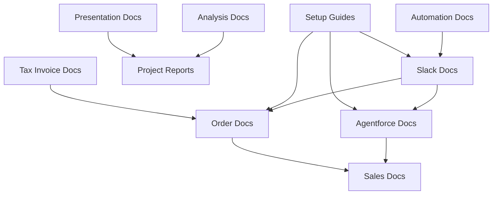

# 📚 Documentation 구조화 완료

## 🎯 프로젝트 개요
MainOrgProject의 모든 문서들이 용도별로 체계적으로 구조화되었습니다.

## 📁 폴더 구조

### 🤖 **agentforce_docs/** - Agentforce 관련 문서
- SOCAR B2B AI Assistant (Agentforce) 구축 관련 모든 문서
- 설계, 구현, 배포, 완료 가이드 포함

### 📦 **order_docs/** - Order 관리 문서  
- Order 생성, 관리, 자동화 관련 문서
- 특정 Order 케이스 분석 및 솔루션

### 💼 **sales_docs/** - 영업 관련 문서
- 영업 프로세스, 자산 관리, 채널 관리 문서
- B2B 영업 시스템 설계 및 구현 가이드

### 🔧 **setup_guides/** - 설정 가이드
- 시스템 설정, 문제 해결, 구성 가이드
- 개발 환경 설정 및 트러블슈팅

### 💬 **slack_docs/** - Slack 통합 문서
- Slack 연동 설정, 오류 해결, 구성 가이드
- 채널 관리 및 자동화 문서

### 📊 **project_reports/** - 프로젝트 리포트
- 프로젝트 완료 보고서, 구조 분석 리포트
- 도메인 구조화 및 표준화 보고서

### 💰 **tax_invoice_docs/** - 세금계산서 문서
- 한국 표준 세금계산서 관련 문서
- 세금계산서 시스템 개선 및 완료 보고서

### 🎯 **presentation_docs/** - 발표 자료
- 개인 포트폴리오, 개발자 발표 자료
- 기술 프레젠테이션 문서

### 🔍 **analysis_docs/** - 분석 문서
- 시스템 분석, 아키텍처 분석 문서
- 비즈니스 전략 및 기술 분석

### ⚡ **automation_docs/** - 자동화 문서
- 이메일 자동화, 팀 협업 자동화 문서
- 업무 프로세스 자동화 가이드

## 📊 구조화 통계
- **총 문서 수**: 89개
- **카테고리 수**: 10개  
- **README 문서**: 11개 (메인 + 각 카테고리별)

## 🔗 문서 간 연관관계


## 📝 문서 관리 가이드라인

### 1. 새 문서 추가 시
```
1. 목적에 맞는 카테고리 폴더 선택
2. 명명 규칙 준수: {기능}_{주제}_{타입}.md
3. 해당 폴더의 README 업데이트
```

### 2. 문서 업데이트 시
- 변경 내용 명시
- 관련 문서들과의 일관성 유지
- 버전 정보 업데이트

### 3. 문서 품질 기준
- 명확한 제목과 목적
- 단계별 가이드 제공
- 예시 코드 및 스크린샷 포함
- 관련 문서 링크 제공

## 👥 담당자
- **Lead Developer**: Moon JeongHyeon
- **Documentation Team**: Technical Writing Team
- **각 도메인별**: 해당 영역 전문가

---
*마지막 업데이트: 2025년 7월 29일*
*구조화 완료: 용도별 카테고리 분류 적용*
