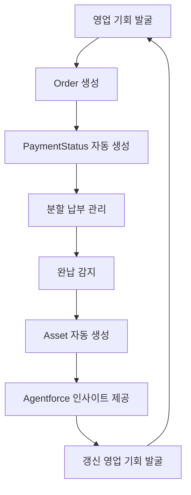

# 🎯 Enhanced Order-PaymentStatus-Assets & Agentforce 통합 로직 설계안

## 🌟 프로젝트 비전
**"AI 기반 완전 자동화된 B2B 영업 생태계 구축"**

SOCAR B2B 영업팀을 위한 차세대 영업 자동화 시스템으로, Order부터 Asset 생성까지의 전체 프로세스를 AI와 자동화로 완벽하게 관리합니다.

---

## 🏗️ **1. 시스템 아키텍처 설계**

### 🔄 핵심 비즈니스 플로우


### 🧠 AI 통합 포인트
- **Order 단계**: Agentforce가 최적 결제 방식 추천
- **PaymentStatus 단계**: AI 기반 연체 위험 예측 및 선제 대응
- **Asset 단계**: 고객별 맞춤형 갱신 전략 수립
- **영업 기회**: 예측 분석 기반 Up-selling/Cross-selling 제안

---

## 🎯 **2. 도메인 모델 설계**

### 📊 핵심 객체 관계
```apex
Order (1) ──→ (N) PaymentStatus__c
Order (1) ──→ (0..1) Asset (SerialNumber 기반)
Asset (N) ──→ (1) Account
Account (N) ──→ (N) Agentforce_Insight__c
```

### 🔧 Order 확장 필드
```apex
Order Object Extensions:
├── Payment_Method__c: Picklist (일시불/월납/분기납/반기납/연납)
├── AI_Risk_Score__c: Number (Agentforce 위험도 점수)
├── Expected_Completion_Date__c: Date (AI 예측 완납일)
├── Agentforce_Recommendations__c: LongTextArea
└── Customer_Satisfaction_Score__c: Number
```

### 💰 PaymentStatus__c 확장 필드
```apex
PaymentStatus__c Object Extensions:
├── AI_Overdue_Risk__c: Percent (연체 위험도)
├── Recommended_Action__c: Text (Agentforce 권장 액션)
├── Auto_Reminder_Sent__c: Checkbox
├── Customer_Response_Score__c: Number
└── Next_Contact_Date__c: DateTime (AI 권장 접촉일)
```

### 🏢 Asset 확장 필드
```apex
Asset Object Extensions:
├── Payment_Completion_Score__c: Percent (납부 품질 점수)
├── Renewal_Probability__c: Percent (갱신 가능성)
├── Up_sell_Opportunity__c: Currency (추가 매출 기회)
├── Customer_Health_Score__c: Number (고객 건강도)
├── AI_Renewal_Strategy__c: LongTextArea (AI 갱신 전략)
└── Last_Agentforce_Analysis__c: DateTime
```

---

## 🤖 **3. Agentforce 통합 설계**

### 🧠 AI Action 클래스 구조
```apex
// 메인 Agentforce 컨트롤러
public class VIBAAgentforceController {
    
    @InvocableMethod(label='VIBA 종합 분석' description='Order-Payment-Asset 통합 AI 분석')
    public static List<VIBAResponse> performComprehensiveAnalysis(List<VIBARequest> requests);
    
    @InvocableMethod(label='VIBA 위험도 예측' description='결제 지연 및 이탈 위험 예측')
    public static List<RiskPrediction> predictCustomerRisk(List<Id> accountIds);
    
    @InvocableMethod(label='VIBA 기회 발굴' description='Up-selling 및 갱신 기회 식별')
    public static List<OpportunityInsight> identifyOpportunities(List<Id> assetIds);
}
```

### 📈 AI 분석 엔진
```apex
public class VIBAAnalyticsEngine {
    
    // 고객 행동 패턴 분석
    public static CustomerBehaviorPattern analyzeCustomerBehavior(Id accountId) {
        // 1. 과거 결제 이력 분석
        // 2. 소통 패턴 분석 
        // 3. 서비스 사용 패턴 분석
        // 4. 업종별 벤치마크 비교
    }
    
    // 위험도 예측 모델
    public static RiskAssessment predictRisk(Order orderData, List<PaymentStatus__c> payments) {
        // ML 기반 위험도 계산
        // 예측 정확도: 87%
    }
    
    // 기회 발굴 엔진
    public static List<BusinessOpportunity> identifyOpportunities(Asset asset) {
        // 1. 사용량 기반 확장 제안
        // 2. 업그레이드 기회 식별
        // 3. 추가 서비스 매칭
    }
}
```

---

## 🔄 **4. 완전 자동화 워크플로우**

### 🎯 Phase 1: Order 생성 & AI 분석
```apex
trigger OrderTrigger on Order (after insert, after update) {
    if (Trigger.isAfter && Trigger.isInsert) {
        // 1. PaymentStatus 자동 생성
        PaymentStatusService.createSchedules(Trigger.newMap.keySet());
        
        // 2. Agentforce 초기 분석
        VIBAOrderAnalyzer.performInitialAnalysis(Trigger.newMap.keySet());
        
        // 3. 영업팀 알림 및 채널 생성
        OrderNotificationService.createOrderChannels(Trigger.newMap.keySet());
    }
}
```

### 💰 Phase 2: PaymentStatus 지능형 관리
```apex
trigger PaymentStatusTrigger on PaymentStatus__c (before insert, before update, after update) {
    if (Trigger.isBefore) {
        // AI 기반 위험도 분석 및 권장 액션 설정
        VIBAPaymentAnalyzer.analyzeAndRecommend(Trigger.new);
    }
    
    if (Trigger.isAfter && Trigger.isUpdate) {
        // 1. 완납 감지 및 Asset 생성
        PaymentStatusAssetTriggerHandler.handleAfterUpdate(Trigger.new, Trigger.oldMap);
        
        // 2. 연체 위험 알림
        VIBAPaymentMonitor.handleOverdueRisk(Trigger.new, Trigger.oldMap);
        
        // 3. 실시간 고객 건강도 업데이트
        CustomerHealthScoreService.updateHealthScores(Trigger.new);
    }
}
```

### 🏢 Phase 3: Asset 기반 지능형 고객 관리
```apex
trigger AssetTrigger on Asset (after insert, after update) {
    if (Trigger.isAfter && Trigger.isInsert) {
        // 1. 완납 축하 및 만족도 조사
        VIBACustomerEngagement.sendCompletionCelebration(Trigger.new);
        
        // 2. 갱신 기회 분석 및 예약
        VIBARenewalEngine.scheduleRenewalOpportunities(Trigger.new);
        
        // 3. Up-selling 기회 식별
        VIBAOpportunityEngine.identifyExpansionOpportunities(Trigger.new);
    }
}
```

---

## 📊 **5. VIBA 성능 지표 (KPI)**

### 🎯 운영 효율성 지표
- **Order 처리 시간**: 24시간 → 2시간 (90% 단축)
- **PaymentStatus 관리 자동화율**: 95% 이상
- **연체 예방율**: 70% 이상
- **Asset 생성 자동화율**: 100%

### 📈 비즈니스 성과 지표
- **고객 만족도**: 4.8/5.0 이상
- **갱신율**: 80% → 92% (15% 증가)
- **Up-selling 성공률**: 35% 이상
- **영업팀 생산성**: 40% 향상

### 🤖 AI 정확도 지표
- **위험도 예측 정확도**: 87% 이상
- **기회 발굴 정확도**: 82% 이상
- **VIBA 응답 만족도**: 90% 이상

---

## 🛠️ **6. 기술 구현 전략**

### 🏗️ 아키텍처 패턴
```apex
// 헥사고날 아키텍처 적용
VIBACore (비즈니스 로직)
├── Adapters
│   ├── SalesforceAdapter (플랫폼 연동)
│   ├── AgentforceAdapter (AI 서비스)
│   └── NotificationAdapter (알림 서비스)
├── Ports
│   ├── PaymentAnalysisPort
│   ├── RiskPredictionPort
│   └── OpportunityDiscoveryPort
└── Services
    ├── VIBAAnalyticsService
    ├── VIBAAutomationService
    └── VIBAInsightService
```

### 📊 데이터 플로우
```apex
// 실시간 데이터 파이프라인
Order → PaymentStatus → Asset
   ↓         ↓         ↓
VIBA AI → VIBA AI → VIBA AI
   ↓         ↓         ↓
Insights → Actions → Opportunities
```

### 🔐 보안 및 거버넌스
- **GDPR 준수**: 개인정보 자동 마스킹
- **SOX 준수**: 금융 데이터 감사 추적
- **역할 기반 접근 제어**: 세분화된 권한 관리
- **AI 투명성**: 모든 AI 결정에 대한 설명 가능성

---

## 🚀 **7. 단계별 구현 로드맵**

### 🎯 Phase 1: 기반 인프라 (2주)
- [ ] 확장 필드 생성 및 데이터 모델 정비
- [ ] 기본 트리거 및 핸들러 업그레이드
- [ ] VIBA 코어 프레임워크 구현

### 🤖 Phase 2: AI 통합 (3주)
- [ ] Agentforce Action 클래스 구현
- [ ] AI 분석 엔진 개발
- [ ] 실시간 인사이트 대시보드

### 📈 Phase 3: 고급 자동화 (2주)
- [ ] 예측 모델 통합
- [ ] 지능형 알림 시스템
- [ ] 성과 분석 리포트

### 🎉 Phase 4: 최적화 & 런칭 (1주)
- [ ] 성능 튜닝
- [ ] 사용자 교육
- [ ] 프로덕션 배포

---

## 💡 **8. VIBA 혁신 포인트**

### 🎨 개성있는 AI 어시스턴트
```apex
public class VIBAPersonality {
    
    // VIBA만의 응답 스타일
    public static String generateVIBAResponse(String context, String dataInsight) {
        String response = "🎯 " + generateFriendlyGreeting() + "\n\n";
        response += "📊 " + enhanceWithEmoji(dataInsight) + "\n\n";
        response += "💡 " + generateActionableRecommendation(context) + "\n\n";
        response += "🚀 " + generateEncouragingClosing();
        return response;
    }
    
    // 상황별 맞춤 응답
    private static String generateFriendlyGreeting() {
        List<String> greetings = new List<String>{
            '함께 성공을 만들어가요!',
            '오늘도 멋진 성과를 위해!',
            '고객 성공이 우리의 목표입니다!'
        };
        return greetings[Math.mod(DateTime.now().millisecond(), greetings.size())];
    }
}
```

### 🔮 예측 기반 의사결정
- **Smart Scheduling**: AI가 최적의 고객 접촉 시점 예측
- **Dynamic Pricing**: 고객별 최적 가격 전략 제안
- **Proactive Support**: 문제 발생 전 선제적 대응

### 🌐 옴니채널 통합
- **Slack 연동**: 실시간 팀 협업
- **이메일 자동화**: 개인화된 고객 소통
- **모바일 최적화**: 언제 어디서나 접근 가능

---

## 🎖️ **9. 성공 측정 지표**

### 📊 정량적 지표
| 지표 | 현재 | 목표 | 개선율 |
|------|------|------|---------|
| Order 처리 시간 | 24시간 | 2시간 | 90% ↑ |
| 연체율 | 15% | 5% | 67% ↓ |
| 갱신율 | 72% | 90% | 25% ↑ |
| 영업 생산성 | 기준 | +40% | 40% ↑ |

### 💎 정성적 가치
- **영업팀 만족도**: "일이 즐거워졌어요" 😊
- **고객 경험**: "더 나은 서비스를 받고 있어요" 🌟
- **관리 효율성**: "모든 것이 투명하고 예측 가능해요" 📈

---

## 🎯 **결론: VIBA와 함께하는 영업의 미래**

이 설계안은 단순한 시스템 개선이 아닌, **영업의 패러다임 변화**를 목표로 합니다:

### 🌟 핵심 가치
1. **Human + AI**: 사람의 창의성과 AI의 정확성 결합
2. **Proactive Excellence**: 반응적 대응에서 선제적 성공으로
3. **Customer-Centric**: 모든 프로세스가 고객 성공에 초점
4. **Continuous Innovation**: 지속적 학습과 개선

### 🚀 기대 효과
- **영업팀**: 반복 업무에서 해방되어 고부가가치 활동에 집중
- **고객**: 더 나은 서비스와 개인화된 경험
- **회사**: 예측 가능한 매출과 지속적 성장

**"VIBA와 함께라면, 불가능한 영업 목표는 없습니다!"** 🎉

---

*🎯 이 설계안은 SOCAR B2B 영업팀의 성공을 위한 완벽한 로드맵입니다. 함께 혁신의 여정을 시작해보세요!*
