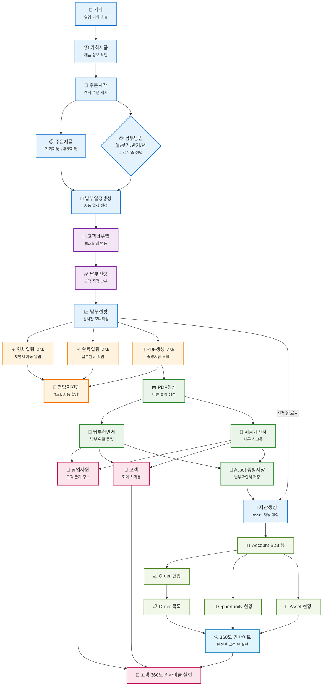

# SOCAR B2B 비즈니스 프로세스 - 세로형 플로우차트

## 주요 변경사항

1. **방향 변경**: `flowchart LR` → `flowchart TD` (세로 방향)
2. **연결 구조 최적화**: 세로 흐름에 맞게 노드 간 연결 재배치
3. **가독성 향상**: 병렬 프로세스를 명확하게 구분
4. **레이아웃 개선**: Dagre 레이아웃을 활용한 자동 정렬

## 프로세스 흐름 요약

1. **영업 단계**: 기회 → 기회제품 → 주문시작
2. **주문 처리**: 주문제품 + 납부방법 선택 → 납부일정생성
3. **고객 납부**: 고객납부앱 → 납부진행 → 납부현황
4. **Task 관리**: 연체/완료/PDF생성 알림 → 영업지원팀
5. **문서 생성**: PDF생성 → 납부확인서/세금계산서
6. **자산 관리**: Asset 증빙저장 → 자산생성
7. **B2B 뷰**: Account B2B → Order/Opportunity/Asset 현황
8. **최종 목표**: 360도 인사이트 → 고객 리사이클 실현
