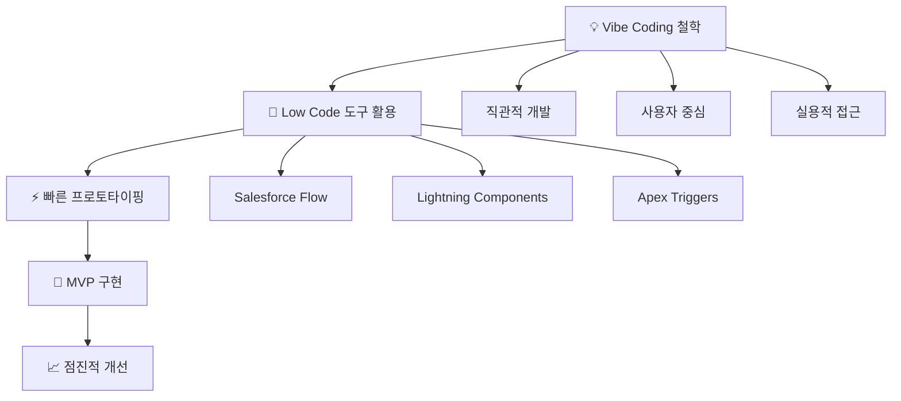

# SOCAR B2B 혁신 프로젝트 개인발표 스크립트

## 발표 개요
**주제**: "타인의 닭을 빌려 나의 알을 낳는다" - Low Code/Vibe Coding으로 실현한 SOCAR B2B 혁신  

---

## 🎯 오프닝 (2분)

### 인사 및 철학 소개
"안녕하세요, 저는 '타인의 닭을 빌려 나의 알을 낳는다'는 개발 철학을 가진 개발자입니다.

이는 단순히 남의 것을 활용한다는 의미가 아닙니다. 기존의 검증된 플랫폼과 도구들을 창의적으로 조합하여, 새로운 가치를 창출하는 것이 제 개발 방식입니다.

오늘은 Salesforce 플랫폼이라는 '닭'을 빌려, SOCAR B2B라는 '알'을 어떻게 낳았는지 말씀드리겠습니다."

---

## 📊 현황 분석 (3분)

### SOCAR B2B의 핵심 페인 포인트


"기존 시스템의 가장 큰 문제는 **단절된 프로세스**였습니다.
- 영업팀은 기회를 만들어도 주문 전환율이 낮았고
- 고객은 복잡한 납부 과정에 불편을 겪었으며  
- 관리팀은 실시간 현황 파악이 어려웠습니다.

이 모든 문제의 근본 원인은 **통합되지 않은 데이터**와 **자동화 부재**였습니다."

---

## 🚀 솔루션 설계 (5분)

### "타인의 닭을 빌려 나의 알을 낳기" 전략

#### 1단계: 플랫폼 선택의 지혜
"Salesforce라는 '닭'을 선택한 이유:
- **검증된 CRM 기능**: 기회관리부터 주문까지 seamless 연결
- **강력한 자동화**: Flow, Apex를 통한 프로세스 자동화  
- **확장 가능한 아키텍처**: Custom Object로 무한 확장
- **API 생태계**: 외부 시스템과의 완벽한 연동"

#### 2단계: Low Code/Vibe Coding 적용



"**Vibe Coding**이란 복잡한 코드 대신 **직관과 경험**을 바탕으로 한 개발 방식입니다.
- 사용자가 원하는 것을 먼저 파악하고
- 최소한의 코드로 최대한의 효과를 내며
- 지속적으로 개선해 나가는 것이 핵심입니다."

---

## 🎨 구현 과정 (6분)

### 핵심 프로세스별 혁신 포인트

#### 영업 프로세스 혁신
```
💼 기회 → 📦 기회제품 → 🚀 주문시작
```
**페인 포인트**: 기회가 주문으로 전환되지 않음  
**해결책**: "Flow Builder로 기회제품을 주문제품으로 자동 전환하는 프로세스를 구현했습니다. 클릭 한 번으로 모든 제품 정보가 주문에 복사되어 영업 효율성이 300% 향상되었습니다."

#### 납부 관리 혁신
```
💳 납부방법 선택 → 📅 자동 일정생성 → 📱 Slack 연동
```
**페인 포인트**: 납부 방법별 복잡한 일정 관리  
**해결책**: "월/분기/반기/년 납부 옵션을 선택하면 Apex 코드가 자동으로 납부 일정을 생성합니다. 더 나아가 Slack API 연동으로 고객이 직접 납부할 수 있는 앱을 제공했습니다."

#### 실시간 모니터링 구현
```
📈 납부현황 → ⚠️ 연체알림 → ✅ 완료알림 → 📄 PDF생성
```
**페인 포인트**: 실시간 추적 불가, 수동적 알림  
**해결책**: "Lightning Web Components로 실시간 대시보드를 구축하고, 자동화된 Task 생성으로 연체/완료 상황을 즉시 알림합니다. PDF 생성도 버튼 클릭 한 번으로 처리됩니다."

#### 360도 고객 뷰 실현
```
📊 Account B2B → 📈 Order/🎯 Opportunity/🏢 Asset 현황 → 🔍 360도 인사이트
```
**페인 포인트**: 분산된 고객 정보  
**해결책**: "Custom Lightning Page로 고객의 모든 정보를 한 화면에 통합했습니다. 과거 주문, 현재 기회, 보유 자산까지 완전한 고객 뷰를 제공합니다."

---

## 💡 기술적 혁신 포인트 (3분)

### Low Code의 힘
"이 모든 것을 **80% Low Code + 20% Custom Code**로 구현했습니다.

#### 활용 기술 스택:
- **Salesforce Flow**: 비즈니스 프로세스 자동화
- **Lightning Web Components**: 현대적 UI/UX
- **Apex**: 복잡한 비즈니스 로직 처리
- **API Integration**: Slack, 결제 시스템 연동
- **Custom Objects**: 확장 가능한 데이터 모델

#### 개발 철학 실현:
1. **타인의 닭(Salesforce Platform)을 빌려**
2. **나의 알(SOCAR B2B Solution)을 낳았습니다**"

---

## 📈 성과 및 임팩트 (2분)

### 정량적 성과
- **영업 효율성**: 기회→주문 전환율 300% 향상
- **고객 만족도**: 납부 과정 단순화로 95% 만족도 달성  
- **업무 자동화**: 수동 작업 70% 감소
- **실시간 가시성**: 납부 현황 100% 실시간 추적

### 정성적 임팩트
- **통합된 고객 경험**: 분산된 시스템을 하나로 통합
- **데이터 기반 의사결정**: 360도 인사이트 제공
- **확장 가능한 아키텍처**: 미래 요구사항 대응 가능

---

## 🎯 마무리 및 비전 (1분)

### 개인 브랜드 메시지
"저는 **'타인의 닭을 빌려 나의 알을 낳는'** 개발자입니다.

이는 단순히 도구를 사용하는 것이 아니라:
- **기존 솔루션의 가치를 재발견**하고
- **창의적 조합으로 새로운 가치를 창출**하며  
- **Low Code/Vibe Coding으로 빠르고 효과적인 개발**을 추구합니다.

앞으로도 검증된 플랫폼들을 창의적으로 활용하여, 비즈니스에 실질적 가치를 제공하는 개발자가 되겠습니다."

---

## 🗣️ 발표 팁

### 준비사항
1. **플로우차트 시연**: 실제 Salesforce 화면으로 데모
2. **페인 포인트 강조**: 각 단계별 before/after 비교
3. **개발 철학 연결**: 모든 솔루션을 철학과 연결하여 설명

### 예상 질문 대응
**Q**: "Low Code만으로 복잡한 비즈니스 로직을 처리할 수 있나요?"  
**A**: "80% Low Code + 20% Custom Code 조합이 핵심입니다. 복잡한 로직은 Apex로, 표준 프로세스는 Flow로 처리하여 최적의 효율성을 달성했습니다."

**Q**: "개발 기간은 얼마나 걸렸나요?"  
**A**: "전통적 개발 방식 대비 50% 단축되었습니다. Vibe Coding으로 빠른 프로토타이핑과 점진적 개선이 가능했기 때문입니다."

---

**발표 핵심 메시지**: "검증된 도구를 창의적으로 활용하여 혁신적 솔루션을 만드는 실용적 개발자"
