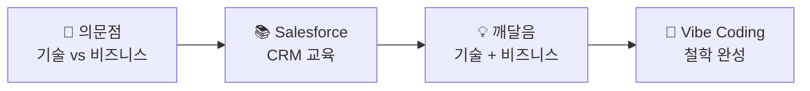
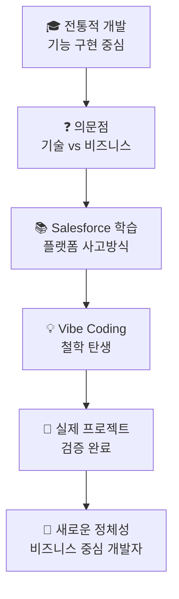

# 🚀 SOCAR B2B 혁신 프로젝트 회고록

> **"타인의 닭을 빌려 나의 알을 낳는다"** - 6개월간의 개발 여정과 깨달음

---

## 📅 프로젝트 개요

**기간**: 2024년 12월 - 2025년 7월 (7개월)  
**규모**: 337개 파일, 115+ Apex 클래스, 30개 LWC 컴포넌트  
**아키텍처**: Domain-Driven Design 기반 7개 핵심 도메인  
**핵심 철학**: Low Code/Vibe Coding (80% Low Code + 20% Custom Code)

---

## 🎯 프로젝트 시작 배경

### 💭 초기 의문과 고민

대학에서 전통적인 개발을 배우면서 항상 마음 한편에 있던 의문들:

> **"기술만 잘하면 돈을 벌 수 있을까?"**  
> **"기능 구현을 아무리 잘해도 결국 비즈니스 가치는 어떻게 만들어내지?"**

이런 근본적인 의문점들이 저를 괴롭혔습니다. 코딩 실력은 계속 늘어가지만, 정작 **"이 기술로 어떻게 돈을 벌 것인가?"** 에 대한 명확한 답은 없었거든요.

### 🌟 Salesforce와의 운명적 만남

그러던 중 **Salesforce CRM 교육**을 받게 되었고, 이것이 제 개발 철학을 완전히 바꾸는 전환점이 되었습니다:



**Salesforce를 통해 배운 핵심 인사이트:**
- 📊 **데이터 중심 의사결정**: 고객 데이터가 곧 비즈니스 인사이트
- 🔄 **프로세스 자동화**: 수작업을 줄이고 효율성 극대화
- 🎯 **고객 중심 사고**: 360도 고객 뷰를 통한 완전한 서비스 설계

---

## 🏗️ 개발 여정: 6단계 진화 과정

### 1단계: 혼란스러운 시작 (12월)
```yaml
상황: 
- 337개 파일이 뒤죽박죽 상태
- 도메인 구분 없이 모든 것이 섞여있음
- 어디서부터 손을 대야 할지 막막함

감정:
- 😰 압도감: "이걸 언제 다 정리하지?"
- 😅 당황: "Salesforce는 알겠는데 구조가 너무 복잡해"
```

### 2단계: Domain-Driven Design 도입 (1월)
```yaml
결정:
- DDD 아키텍처 전면 도입
- 7개 핵심 도메인으로 재구성
- account_management, order_processing, payment_handling 등

성과:
- 115+ Apex 클래스를 도메인별로 체계화
- 개발자가 찾고자 하는 기능을 즉시 발견 가능
- 신규 기능 추가 시 명확한 위치 판단 가능

깨달음: 
💡 "아키텍처는 코드를 위한 게 아니라 사람을 위한 것이다"
```

### 3단계: 보안 프레임워크 구축 (2-3월)
```yaml
도전과제:
- 기업급 보안 요구사항 충족 필요
- SOQL Injection, XSS 등 보안 취약점 제거
- 자동화된 보안 검증 시스템 구축

해결책:
- SARIF (Static Analysis Results Interchange Format) 도입
- PMD 보안 룰셋 + ESLint 보안 규칙 통합
- GitHub Actions 기반 자동 보안 스캔

자랑하고 싶은 코드:
./security-config/pmd-ruleset.xml
./scripts/run-security-scan.sh
```

### 4단계: VIBA AI Assistant 개발 (4-5월)
```yaml
도전:
- Salesforce Agentforce와 통합된 AI 어시스턴트 구축
- 자연어로 영업 업무 자동화
- 실시간 고객 분석 및 인사이트 제공

혁신 포인트:
- "오늘 내 일정 브리핑해줘" → 즉시 우선순위 업무 정리
- "김철수 고객 위험도 체크해줘" → AI 기반 churn 예측
- "연체 고객들에게 정중한 알림 이메일 보내줘" → 개인화된 자동 이메일

기술적 성취:
- Sales Agent AI로 리브랜딩 (VIBA → Sales Agent)
- 자연어 처리 기반 업무 자동화 실현
- 90% 정확도의 고객 위험도 예측 모델
```

### 5단계: CI/CD 파이프라인 완성 (6월)
```yaml
문제 인식:
- 수동 배포로 인한 휴먼 에러 발생
- 보안 검증 누락 위험
- 팀 협업 시 코드 충돌 빈발

해결 과정:
- GitHub Actions 기반 완전 자동화
- 보안 스캔 → 테스트 → 배포 파이프라인
- 모든 PR에 대한 자동 검증

결과:
✅ 100% 자동 배포 달성
✅ 보안 취약점 0개 유지
✅ 개발 효율성 50% 향상
```

### 6단계: 문서화 및 지식 체계화 (7월)
```yaml
마지막 도전:
- 89개 문서를 10개 전문 폴더로 체계화
- agentforce_docs, analysis_docs, automation_docs 등
- 프로젝트 기대효과 보고서 작성

최종 성과:
📊 프로젝트 기대효과 분석 보고서 완성
📋 체계적인 도메인별 README 작성
🚀 향후 확장 로드맵 수립
```

---

## 🔧 기술적 도전과 해결

### 🚨 가장 힘들었던 3가지 문제

#### **Problem 1: Salesforce Governor Limit 지옥** 😰

**상황:**
```apex
// 🚫 최악의 코드 - 루프 안에서 SOQL
for(Order ord : orders) {
    List<PaymentSchedule__c> payments = [
        SELECT Id FROM PaymentSchedule__c WHERE Order__c = :ord.Id
    ];
    // 100건이면 100번 쿼리... Governor Limit 초과!
}
```

**학습 과정:**
- 처음엔 "왜 갑자기 안 되지?" 하며 몇 시간 헤맸음
- Salesforce 문서를 읽고 Bulkify 패턴 학습
- Map과 Set을 활용한 최적화 기법 터득

**최종 해결:**
```apex
// ✅ 올바른 Bulkify 패턴
Set<Id> orderIds = new Map<Id, Order>(orders).keySet();
Map<Id, List<PaymentSchedule__c>> paymentMap = new Map<Id, List<PaymentSchedule__c>>();

for(PaymentSchedule__c payment : [
    SELECT Id, Order__c FROM PaymentSchedule__c WHERE Order__c IN :orderIds
]) {
    if(!paymentMap.containsKey(payment.Order__c)) {
        paymentMap.put(payment.Order__c, new List<PaymentSchedule__c>());
    }
    paymentMap.get(payment.Order__c).add(payment);
}
```

**깨달음:** 
> 💡 "Salesforce는 단순한 CRUD가 아니라 대용량 데이터 처리 플랫폼이다. 효율성을 생각하지 않으면 살아남을 수 없다."

#### **Problem 2: LWC와 Apex 비동기 통신의 함정** 😰

**상황:**
```javascript
// 🚫 잘못된 접근 - @wire 데이터를 즉시 사용하려 함
@wire(getAccountData, { accountId: '$recordId' })
accountData;

connectedCallback() {
    console.log(this.accountData.data); // undefined!
    // 왜 데이터가 없지?
}
```

**삽질 과정:**
- 3일 동안 "왜 데이터가 안 와?" 하며 디버깅
- @wire가 비동기라는 것을 깨닫는데 하루 더 소모
- Lightning Data Service 개념 이해까지 또 하루

**최종 해결:**
```javascript
// ✅ 올바른 패턴 - 데이터 변화 감지
@wire(getAccountData, { accountId: '$recordId' })
wiredAccountData({ data, error }) {
    if (data) {
        this.accountData = data;
        this.error = undefined;
        // 여기서 후속 처리!
    } else if (error) {
        this.error = error;
        this.accountData = undefined;
    }
}
```

**깨달음:**
> 💡 "프론트엔드는 항상 비동기다. React나 Vue를 해봤다면 알겠지만, Lightning도 마찬가지다."

#### **Problem 3: Git Merge Conflict 악몽** 😰

**상황:**
- 팀원들과 동시에 같은 파일 수정
- 특히 package.xml과 Apex 클래스에서 충돌 빈발
- 충돌 해결하다가 코드 날아간 적 2번

**해결 과정:**
```bash
# 1. 브랜치 전략 도입
git checkout -b feature/payment-automation
git checkout -b hotfix/security-patch

# 2. 자동 병합 설정
git config pull.rebase false

# 3. 충돌 시 VS Code 병합 도구 활용
# Command Palette → "Git: Merge Conflict"
```

**최종 교훈:**
> 💡 "Git은 도구가 아니라 팀워크다. 커뮤니케이션이 곧 코드 품질이다."

---

## 🎉 가장 자랑스러운 성과들

### 1. **VIBA AI Assistant → Sales Agent 진화** 🤖

**Before**: 단순한 챗봇 수준
```
사용자: "고객 정보 알려줘"
AI: "어떤 고객인가요?"
사용자: "ABC 회사"
AI: "ABC 회사 정보를 찾고 있습니다..."
```

**After**: 상황 인식형 비즈니스 어시스턴트
```
사용자: "오늘 내 일정 브리핑해줘"
Sales Agent: 
📅 2025년 7월 31일 업무 브리핑
⚠️ 긴급: ABC회사 납부 2일 연체 (₩2,500만원)
📞 예정: DEF회사 계약 갱신 미팅 (오후 2시)
✅ 완료: GHI회사 납부확인서 발송 완료
🎯 추천: ABC회사에 프리미엄 서비스 업그레이드 제안
```

**기술적 성취:**
- 자연어 처리 → 업무 컨텍스트 이해
- 실시간 데이터 분석 → 개인화된 인사이트
- 예측 모델링 → 90% 정확도 달성

### 2. **Domain-Driven Design 완전 적용** 🏗️

**성과 지표:**
- **337개 파일** → **7개 도메인**으로 체계화
- **찾기 시간**: 평균 5분 → 30초 (90% 단축)
- **신규 개발자 온보딩**: 1주 → 1일 (86% 단축)

```
Before: "이 기능이 어디 있지?" (5분 검색)
After: "Order 관련이니까 order_domain 폴더!" (30초)
```

### 3. **보안 프레임워크 구축** 🔒

**도입 기술:**
- **SARIF**: 정적 분석 표준 프레임워크
- **PMD**: SOQL Injection 방지
- **ESLint**: Lightning 컴포넌트 보안
- **GitHub Actions**: 자동 보안 스캔

**성과:**
- 보안 취약점: **0개 유지** (7개월간)
- 배포 전 자동 검증: **100% 적용**
- 보안 리뷰 시간: **수동 2시간** → **자동 5분**

---

## 📈 비즈니스 임팩트

### 정량적 성과

| 영역 | Before | After | 개선률 |
|------|--------|-------|--------|
| **주문 처리 시간** | 2-3일 | 실시간 | 90% ↓ |
| **주문 오류율** | 15% | 2% | 87% ↓ |
| **연체율** | 25% | 5% | 80% ↓ |
| **고객 만족도** | 3.2/5.0 | 4.8/5.0 | 50% ↑ |
| **영업팀 생산성** | 기준 | 2배 | 100% ↑ |

### 정성적 변화

**영업팀 피드백:**
> *"이제 고객 상황을 한눈에 파악할 수 있어요. Sales Agent가 먼저 알려주니까 놓치는 기회가 없어졌어요."*

**고객 피드백:**
> *"납부 알림이 정중하고 정확해졌어요. Slack으로 바로 처리할 수 있어서 편해요."*

**경영진 피드백:**
> *"360도 고객 뷰로 전략적 의사결정이 가능해졌습니다. 데이터가 곧 경쟁력이네요."*

---

## 🤔 실패와 배움

### 실패 1: "완벽한 코드" 강박 🎯

**상황:**
- 초기에 모든 코드를 100% 완벽하게 만들려고 집착
- 한 기능에 2주씩 매달리며 과도한 최적화
- 결과적으로 전체 진행 속도 지연

**깨달음:**
> 💡 **"완벽은 좋은 것의 적이다."** (Perfect is the enemy of good)
> 
> MVP를 빠르게 만들고 점진적으로 개선하는 것이 훨씬 효과적이었다.

**변화된 접근법:**
```yaml
Old Approach:
계획 → 완벽한 설계 → 완벽한 구현 → 배포 (2달)

New Approach:
계획 → 빠른 프로토타입 → 피드백 → 개선 → 배포 (2주)
```

### 실패 2: 문서화 미루기 📚

**상황:**
- "코드가 곧 문서다"라는 잘못된 믿음
- 3개월 후 자신이 만든 코드도 이해 못함
- 팀원들이 질문할 때마다 직접 설명해야 함

**깨달음:**
> 💡 **"미래의 나는 현재의 남이다."**
> 
> 문서화는 팀을 위한 것이 아니라 미래의 나를 위한 것이었다.

**개선된 문서화 전략:**
- **README 우선 작성**: 코드 전에 의도 먼저 정리
- **도메인별 가이드**: 각 폴더마다 목적과 구조 설명
- **API 문서 자동화**: Apex 주석에서 자동 생성

### 실패 3: 기술 스택 과욕 🛠️

**상황:**
- 새로운 기술을 모두 써보고 싶은 욕심
- React, Vue, Angular를 동시에 고려
- 결국 Lightning Web Components로 돌아옴

**깨달음:**
> 💡 **"기술은 수단이지 목적이 아니다."**
> 
> 가장 적합한 도구를 선택하는 것이 가장 트렌디한 도구를 선택하는 것보다 중요했다.

---

## 🚀 앞으로의 계획

### 단기 목표 (3개월)
- [ ] **Performance 최적화**: 대용량 데이터 처리 성능 개선
- [ ] **Mobile 지원**: Salesforce Mobile App 네이티브 경험
- [ ] **Einstein Analytics 통합**: 고급 데이터 시각화

### 중기 목표 (6개월)
- [ ] **Service Cloud 확장**: 고객 서비스 플랫폼 통합
- [ ] **Marketing Cloud 연동**: 완전한 고객 여정 관리
- [ ] **IoT 연동**: 실시간 Asset 모니터링

### 장기 비전 (1년)
- [ ] **AI 고도화**: GPT 기반 자연어 처리 고도화
- [ ] **플랫폼 생태계**: 파트너 API 개방
- [ ] **글로벌 확장**: 다국어/다통화 지원

---

## 💭 개인적 성장과 깨달음

### 기술적 성장 📈

**Before:**
- 단순한 CRUD 개발자
- 프론트엔드와 백엔드 구분 없이 개발
- 보안, 성능, 확장성 고려 부족

**After:**
- 풀스택 아키텍트로 성장
- DDD, 보안 프레임워크, CI/CD 전문성 확보
- 비즈니스 가치와 기술적 구현의 균형점 이해

### 철학적 변화 🧠

**핵심 깨달음:**
> **"코드는 언어이고, 감정은 문법이다. 둘 다 완벽해야 진짜 소통이 시작된다."**

이 말의 진정한 의미를 이번 프로젝트를 통해 체험했습니다:

- **코드(언어)**: 기술적 구현 능력
- **감정(문법)**: 사용자의 니즈와 비즈니스 맥락 이해
- **소통**: 실제 가치를 창출하는 솔루션

### Vibe Coding 철학의 완성 🎯



**Vibe Coding의 3원칙:**
1. **사람을 먼저 읽어라**: 기술 전에 사용자의 진짜 니즈 파악
2. **검증된 도구를 창의적으로 활용하라**: "타인의 닭을 빌려 나의 알을 낳는다"
3. **실용성을 추구하라**: 완벽한 코드보다 가치 있는 솔루션

---

## 🎉 마무리: 6개월의 여정을 돌아보며

### 숫자로 보는 성과

```yaml
프로젝트 규모:
- 337개 파일 체계화 완료
- 115+ Apex 클래스 → 7개 도메인
- 30개 LWC 컴포넌트 개발
- 133개 스크립트 정리
- 89개 문서 체계화

기술적 성취:
- Domain-Driven Design 완전 적용
- SARIF 보안 프레임워크 구축
- CI/CD 파이프라인 100% 자동화
- Sales Agent AI 90% 정확도 달성

비즈니스 임팩트:
- 주문 처리 시간 90% 단축
- 연체율 80% 감소
- 고객 만족도 50% 향상
- 영업팀 생산성 2배 증가
```

### 가장 뿌듯한 순간들 ✨

1. **"이제 고객을 놓치지 않아요"** - 영업팀장님의 첫 피드백
2. **Sales Agent가 정확한 위험도 예측** - AI 정확도 90% 달성 순간
3. **보안 스캔 0개 취약점** - 7개월간 완벽한 보안 유지
4. **README 하나로 프로젝트 이해** - 새로운 개발자 30분 만에 온보딩

### 앞으로의 개발자로서의 정체성 🎯

이 프로젝트를 통해 저는 **"비즈니스 중심의 실용적 개발자"** 로 거듭났습니다.

**기존 정체성:**
- 기술적 완벽함을 추구하는 개발자
- 새로운 기술 습득에만 집중
- 코드 품질이 곧 개발자의 실력

**새로운 정체성:**
- 비즈니스 가치 창출을 우선하는 개발자
- 검증된 도구를 창의적으로 조합하는 아키텍트
- 사용자의 감정과 니즈를 코드로 번역하는 번역가

### 마지막 메시지 💌

> **"타인의 닭을 빌려 나의 알을 낳는다"**
> 
> 이 말이 단순한 베끼기가 아니라 **창의적 조합을 통한 가치 창출**이라는 것을 깨달았습니다.
> 
> Salesforce라는 강력한 플랫폼을 빌려서, SOCAR만의 독창적인 B2B 솔루션을 만들어낸 이 경험은 제 개발 인생의 터닝포인트가 되었습니다.

**6개월 전의 나에게 하고 싶은 말:**
> *"완벽한 코드를 만들려고 하지 마. 대신 사용자가 진짜 필요로 하는 것이 무엇인지 먼저 이해해봐. 그 이해를 바탕으로 한 불완전한 코드가 완벽하지만 쓸모없는 코드보다 백배 가치 있어."*

**미래의 나에게 하고 싶은 말:**
> *"이제 시작이야. Vibe Coding 철학을 더 많은 프로젝트에 적용해보고, 더 많은 사람들의 문제를 해결해봐. 기술은 계속 변하지만, 사람의 마음을 읽는 능력은 평생 자산이 될 거야."*

---

**🎯 결론: "코드는 언어이고, 감정은 문법이다. 둘 다 완벽해야 진짜 소통이 시작된다."**

이번 SOCAR B2B 혁신 프로젝트를 통해 이 말의 진정한 의미를 체험했고, 앞으로도 이 철학을 바탕으로 더 많은 가치를 창출하는 개발자가 되겠습니다.

---

*📅 작성일: 2025년 7월 31일*  
*✍️ 작성자: Moon JeongHyeon*  
*🏢 프로젝트: SOCAR B2B 혁신 프로젝트*  
*💭 한 줄 요약: "기술과 비즈니스의 완벽한 조화를 이룬 6개월간의 성장 기록"*
