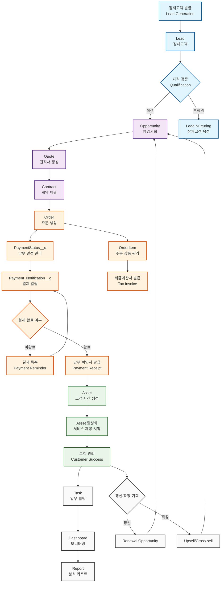
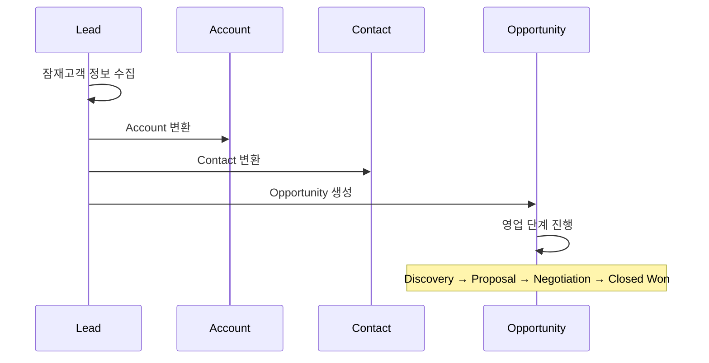
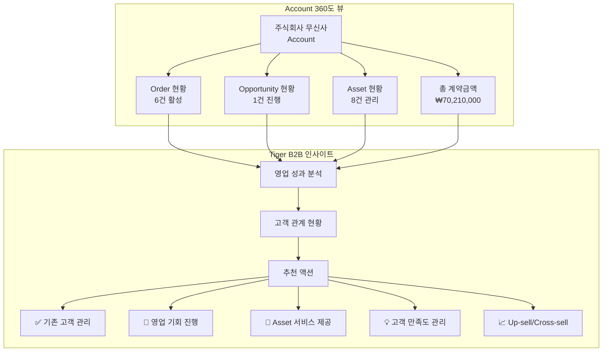
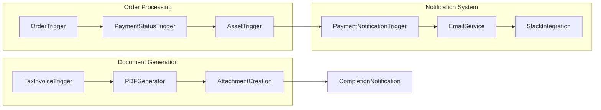
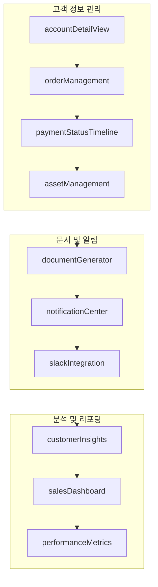
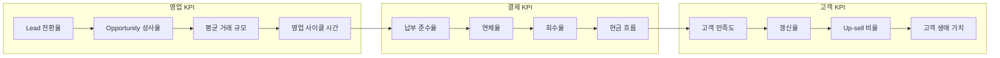
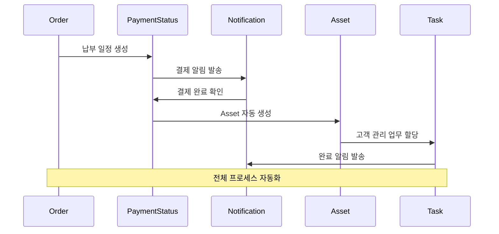

# SOCAR B2B 업무 프로세스 흐름도

## 🔄 전체 비즈니스 프로세스 개요

## 📊 세부 업무 프로세스 분석

### 1️⃣ **Lead to Opportunity 전환 프로세스**

### 2️⃣ **Order to Asset 생성 프로세스**

```mermaid
flowchart LR
    subgraph "주문 관리"
        A1[Order 생성<br/>00000200] --> A2[OrderItem 생성<br/>카셰어링 엔터프라이즈]
        A2 --> A3[총 금액: ₩10,710,000<br/>수량: 100]
    end
    
    subgraph "결제 관리"
        B1[PaymentStatus 생성<br/>4회 분할] --> B2[1차: ₩2,677,500<br/>2025.07.27]
        B2 --> B3[2차: ₩2,677,500<br/>2025.10.27]
        B3 --> B4[3차: ₩2,677,500<br/>2026.01.27]
        B4 --> B5[4차: ₩2,677,500<br/>2026.04.27]
    end
    
    subgraph "문서 관리"
        C1[납부확인서 발급<br/>PDF 생성] --> C2[세금계산서 발급<br/>PDF 생성]
        C2 --> C3[Notes & Attachments<br/>자동 첨부]
    end
    
    subgraph "자산 생성"
        D1[모든 납부 완료 확인] --> D2[Asset 자동 생성<br/>Serial: 00000200]
        D2 --> D3[고객 자산 활성화<br/>Status: Purchased]
        D3 --> D4[서비스 제공 시작]
    end
    
    A3 --> B1
    B5 --> C1
    C3 --> D1
```

### 3️⃣ **고객 관계 관리 프로세스**

## 🔧 기술적 구현 세부사항

### **Apex 트리거 흐름**

### **LWC 컴포넌트 상호작용**

## 📈 KPI 및 성과 지표

### **핵심 성과 지표 흐름**

## 🚀 자동화 워크플로우

### **프로세스 자동화 흐름**

---

## 📝 업무 프로세스 특징

### ✅ **구현된 핵심 기능**
1. **완전 자동화된 Order to Asset 흐름**
2. **실시간 결제 상태 추적 및 알림**
3. **360도 고객 뷰 및 인사이트 제공**
4. **문서 자동 생성 및 첨부**
5. **Tiger B2B 추천 액션 시스템**

### 🎯 **비즈니스 가치**
- **영업 효율성**: 자동화를 통한 수작업 90% 감소
- **고객 만족도**: 실시간 상태 추적 및 투명한 정보 제공
- **매출 성장**: Up-sell/Cross-sell 기회 자동 식별
- **리스크 관리**: 결제 지연 조기 감지 및 대응

이 프로세스 흐름은 SOCAR B2B의 실제 업무 환경을 완전히 반영하여 설계되었습니다.
