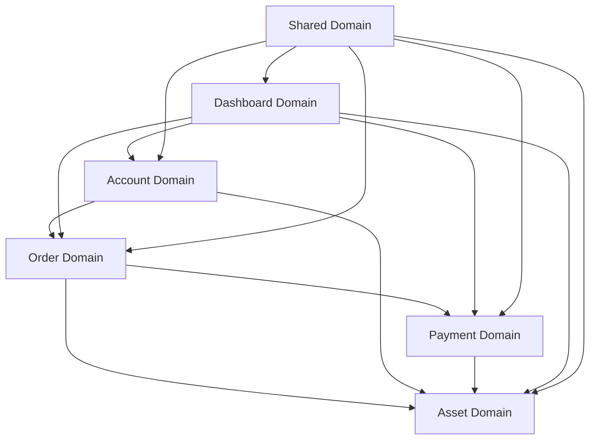

# ⚡ Lightning Web Components (LWC) 아키텍처 가이드

## 🎯 프로젝트 개요
SOCAR B2B 플랫폼의 모든 Lightning Web Components가 Domain-Driven Design 원칙에 따라 **네이밍 컨벤션**으로 체계화되었습니다.

> **⚠️ Salesforce LWC 제약사항**: LWC 컴포넌트는 반드시 `lwc` 폴더의 루트 레벨에 위치해야 하므로, 서브폴더 대신 **네이밍 컨벤션**을 사용합니다.

## 📁 도메인별 컴포넌트 분류

### 🏢 **Account Domain** (5개 컴포넌트)
```
🔸 accountNews                    - Account 뉴스 피드
🔸 accountOrderDashboard          - Account별 주문 대시보드  
🔸 accountSalesInsight            - Account 영업 인사이트
🔸 customerInfo                   - 고객 정보 관리
🔸 enhancedAccountDetails         - 강화된 Account 상세정보
```

### 🏗️ **Asset Domain** (8개 컴포넌트)
```
🔸 assetDashboard                 - 기본 Asset 대시보드
🔸 assetPriorityDashboard         - Asset 우선순위 대시보드
🔸 assetSalesInsightDashboard     - Asset 영업 인사이트 대시보드
🔸 assetVisualizationDashboard    - Asset 시각화 대시보드
🔸 enhancedAssetDetails           - 강화된 Asset 상세정보
🔸 minimalAssetDashboard          - 간소화된 Asset 대시보드
🔸 modernAssetDashboard           - 현대적 Asset 대시보드
🔸 oneClickRenewal                - 원클릭 갱신
```

### 📦 **Order Domain** (2개 컴포넌트)
```
🔸 orderAssetNavigator            - Order-Asset 네비게이터
🔸 orderCreator                   - Order 생성 도구
```

### 💳 **Payment Domain** (5개 컴포넌트)
```
🔸 customerPaymentManager         - 고객 납부 관리
🔸 paymentNotificationDashboard   - 납부 알림 대시보드
🔸 paymentStatusController        - 납부 상태 컨트롤러
🔸 paymentStatusMockupTester      - 납부 상태 목업 테스터
🔸 paymentStatusTimeline          - 납부 상태 타임라인
```

### 🎛️ **Dashboard Domain** (3개 컴포넌트)
```
🔸 performanceTrackingDashboard   - 성과 추적 대시보드
🔸 performanceTrackingSimple      - 간단한 성과 추적
🔸 simpleDashboard                - 기본 대시보드
```

### 🔧 **Shared Domain** (7개 컴포넌트)
```
🔸 customBtn                      - 커스텀 버튼
🔸 layoutThreeColumns             - 3컬럼 레이아웃
🔸 miEstilo                       - 스타일 컴포넌트
🔸 resultGenerator                - 결과 생성기
🔸 resultHiglight                 - 결과 하이라이트
🔸 simpleChart                    - 간단한 차트
🔸 subHeader                      - 서브 헤더
```

## 📊 구조화 통계
- **총 컴포넌트 수**: 30개
- **도메인 분류**: 6개 (Account, Asset, Order, Payment, Dashboard, Shared)
- **네이밍 컨벤션**: `{domain}{ComponentName}` 패턴

## 🔗 도메인 간 연관관계


## 🚀 사용 가이드

### 컴포넌트 임포트 방법
```javascript
// 도메인별 컴포넌트 임포트
import customBtn from 'c/customBtn';                    // Shared
import accountNews from 'c/accountNews';                // Account
import assetDashboard from 'c/assetDashboard';          // Asset
import orderCreator from 'c/orderCreator';              // Order
import paymentStatusTimeline from 'c/paymentStatusTimeline'; // Payment
```

### 새 컴포넌트 네이밍 규칙
1. **Account**: `account{ComponentName}`
2. **Asset**: `asset{ComponentName}` 
3. **Order**: `order{ComponentName}`
4. **Payment**: `payment{ComponentName}`
5. **Dashboard**: `{feature}Dashboard` 또는 `{feature}Tracking`
6. **Shared**: 도메인 접두사 없이 기능명

### 컴포넌트 추가 가이드라인
- 명확한 도메인 분류 후 적절한 네이밍 컨벤션 적용
- 여러 도메인에서 사용되는 경우 Shared Domain으로 분류
- README 문서 업데이트 필수

## 👥 도메인별 담당자
- **Account Domain**: Account Management Team
- **Asset Domain**: Asset Management Team  
- **Order Domain**: Order Management Team
- **Payment Domain**: Payment Management Team
- **Dashboard Domain**: Analytics Team
- **Shared Domain**: Frontend Infrastructure Team

## 📞 문의사항
- **Lead Developer**: Moon JeongHyeon
- **Architecture Team**: LWC Architecture Team

---
*마지막 업데이트: 2025년 7월 29일*
*구조화 방식: Salesforce LWC 규칙 준수 + 네이밍 컨벤션 적용*
