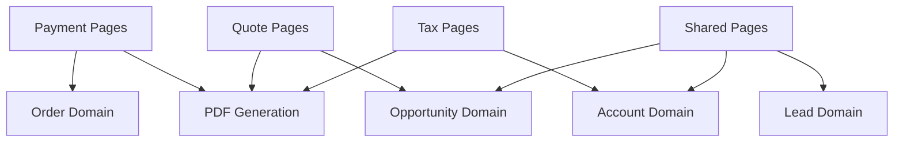

# 📄 Visualforce Pages 구조화 완료

## 🎯 프로젝트 개요
SOCAR B2B 플랫폼의 모든 Visualforce Pages가 Domain-Driven Design 원칙에 따라 체계적으로 구조화되었습니다.

## 📁 도메인별 폴더 구조

### 💳 `payment_pages/` (1개 페이지)
```
payment_pages/
├── README.md
├── PaymentSchedule_PDF.page
└── PaymentSchedule_PDF.page-meta.xml
```
**목적**: 납부 일정표 PDF 생성

### 📝 `quote_pages/` (1개 페이지)  
```
quote_pages/
├── README.md
├── Quotation_PDF.page
└── Quotation_PDF.page-meta.xml
```
**목적**: 견적서 PDF 생성

### 📄 `tax_pages/` (1개 페이지)
```
tax_pages/
├── README.md
├── TaxInvoice_PDF.page
└── TaxInvoice_PDF.page-meta.xml
```
**목적**: 세금계산서 PDF 생성

### 🔧 `shared_pages/` (1개 페이지)
```
shared_pages/
├── README.md
├── SearchAddressMap.page
└── SearchAddressMap.page-meta.xml
```
**목적**: 주소 검색 모달 페이지

## 📊 구조화 통계
- **총 페이지 수**: 4개
- **도메인 폴더 수**: 4개
- **README 문서**: 5개 (메인 + 각 도메인별)

## 🔗 도메인 간 연관관계


## 🚀 페이지별 주요 기능

### 📋 PDF 생성 페이지들
| 페이지 | 도메인 | 컨트롤러 | 출력 형식 |
|--------|--------|----------|-----------|
| PaymentSchedule_PDF | Payment | PaymentStatusPDFController | PDF |
| Quotation_PDF | Quote | QuotationPDFController | PDF |
| TaxInvoice_PDF | Tax | TaxInvoicePDFController | PDF |

### 🔧 유틸리티 페이지들
| 페이지 | 도메인 | 컨트롤러 | 용도 |
|--------|--------|----------|------|
| SearchAddressMap | Shared | SearchAddressModalController | 주소 검색 모달 |

## 🎨 공통 페이지 설정
```xml
<!-- PDF 페이지 공통 설정 -->
- renderAs="pdf"
- showHeader="false"
- sidebar="false"
- standardStylesheets="false"
- contentType="text/html;charset=UTF-8"

<!-- 모달 페이지 공통 설정 -->
- showHeader="false"
- sidebar="false"
- standardStylesheets="false"
```

## 👥 도메인별 담당자
- **Payment Pages**: Payment Management Team
- **Quote Pages**: Sales Team  
- **Tax Pages**: Finance & Legal Team
- **Shared Pages**: Frontend Infrastructure Team

## 📝 새 페이지 추가 가이드라인

### 1. 도메인 분류
- **PDF 문서**: 해당 비즈니스 도메인 폴더
- **공통 유틸리티**: shared_pages 폴더
- **특정 객체 전용**: 해당 객체 도메인 폴더

### 2. 네이밍 컨벤션
```
{Purpose}_{Type}.page
예: PaymentSchedule_PDF.page, CustomerInfo_Modal.page
```

### 3. 필수 문서화
- 도메인별 README 업데이트
- 컨트롤러 연관관계 명시
- 사용 목적 및 기능 설명

## 📞 문의사항
- **Lead Developer**: Moon JeongHyeon
- **Architecture Team**: Visualforce Architecture Team

---
*마지막 업데이트: 2025년 7월 29일*
*구조화 완료: Domain-Driven Design 적용*
