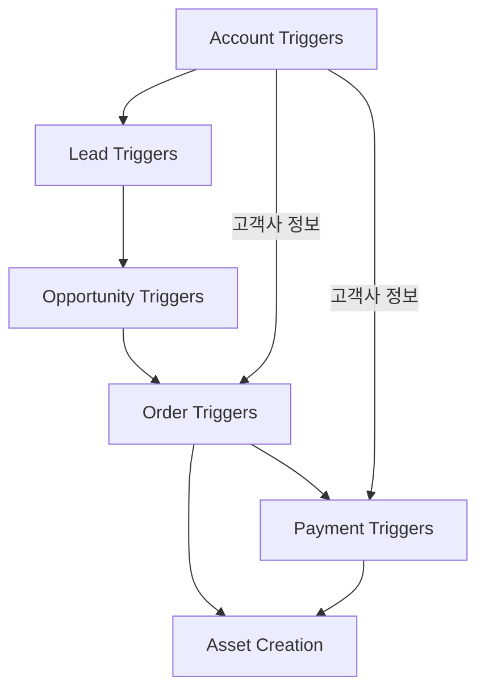
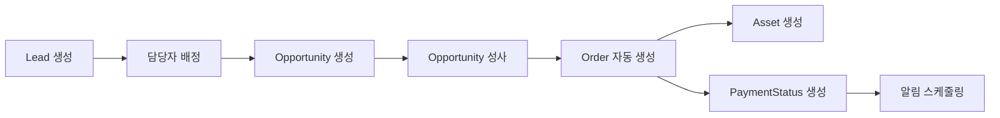

# ⚡ Triggers 구조화 완료

## 🎯 프로젝트 개요
SOCAR B2B 플랫폼의 모든 Apex Triggers가 Domain-Driven Design 원칙에 따라 체계적으로 구조화되었습니다.

## 📁 도메인별 폴더 구조

### 🏢 `account_triggers/` (1개 트리거)
```
account_triggers/
├── README.md
├── AccountTrigger.trigger
└── AccountTrigger.trigger-meta.xml
```
**목적**: Account 객체 이벤트 처리

### 👥 `lead_triggers/` (2개 트리거)
```
lead_triggers/
├── README.md
├── LeadTrigger.trigger
├── LeadTrigger.trigger-meta.xml
├── LeadAssignRepTrigger.trigger
└── LeadAssignRepTrigger.trigger-meta.xml
```
**목적**: Lead 객체 및 담당자 배정 처리

### 🎯 `opportunity_triggers/` (1개 트리거)
```
opportunity_triggers/
├── README.md
├── OpportunityTrigger.trigger
└── OpportunityTrigger.trigger-meta.xml
```
**목적**: Opportunity 성사 시 Order 자동 생성

### 📦 `order_triggers/` (1개 트리거)
```
order_triggers/
├── README.md
├── OrderTrigger.trigger
└── OrderTrigger.trigger-meta.xml
```
**목적**: Order 생성/수정 시 연관 객체 처리

### 💳 `payment_triggers/` (3개 트리거)
```
payment_triggers/
├── README.md
├── PaymentStatusTrigger.trigger
├── PaymentStatusTrigger.trigger-meta.xml
├── PaymentStatusAssetTrigger.trigger
├── PaymentStatusAssetTrigger.trigger-meta.xml
├── PaymentStatusAssetTriggerEnhanced.trigger
└── PaymentStatusAssetTriggerEnhanced.trigger-meta.xml
```
**목적**: PaymentStatus 및 Asset 연동 처리

## 📊 구조화 통계
- **총 트리거 수**: 8개
- **도메인 폴더 수**: 5개
- **README 문서**: 6개 (메인 + 각 도메인별)

## 🔗 도메인 간 연관관계


## ⚡ 트리거 실행 패턴

### 🔄 TriggerManager 패턴 사용
```apex
// 표준 패턴
trigger ObjectTrigger on Object (events) {
    TriggerManager.prepare()
        .bind(new ObjectTriggerHandler())
        .execute();
}
```

### 📋 직접 로직 구현
```apex
// 간단한 로직의 경우
trigger ObjectTrigger on Object (events) {
    if (Trigger.isAfter && Trigger.isInsert) {
        // 직접 로직 구현
    }
}
```

## 🎯 트리거별 주요 기능

| 트리거 | 객체 | 이벤트 | 주요 기능 |
|--------|------|--------|-----------|
| AccountTrigger | Account | CRUD | 데이터 검증, 기본값 설정 |
| LeadTrigger | Lead | Before Insert | 소유자 자동 할당 |
| LeadAssignRepTrigger | Lead | Before CRUD | 담당자 배정 |
| OpportunityTrigger | Opportunity | After Update | Order 자동 생성 |
| OrderTrigger | Order | CRUD | Asset/Payment 생성 |
| PaymentStatusTrigger | PaymentStatus__c | After CRUD | 알림, 연체 처리 |
| PaymentStatusAssetTrigger | PaymentStatus__c | CRUD | Asset 연동 |
| PaymentStatusAssetTriggerEnhanced | PaymentStatus__c | CRUD | 고급 Asset 연동 |

## 🚀 비즈니스 프로세스 플로우


## 👥 도메인별 담당자
- **Account Triggers**: Account Management Team
- **Lead Triggers**: Sales Team
- **Opportunity Triggers**: Sales Team
- **Order Triggers**: Order Management Team
- **Payment Triggers**: Finance Team

## 📝 트리거 개발 가이드라인

### 1. 새 트리거 추가 시
- 해당 도메인 폴더에 배치
- 명명 규칙: `{ObjectName}Trigger.trigger`
- TriggerManager 패턴 사용 권장

### 2. 성능 고려사항
- 벌크 처리 지원 필수
- SOQL 쿼리 최적화
- CPU 및 DML 한계 준수

### 3. 테스트 요구사항
- 최소 75% 코드 커버리지
- 벌크 테스트 포함
- 예외 상황 처리 테스트

## 📞 문의사항
- **Lead Developer**: Moon JeongHyeon
- **Architecture Team**: Trigger Architecture Team

---
*마지막 업데이트: 2025년 7월 29일*
*구조화 완료: Domain-Driven Design 적용*
