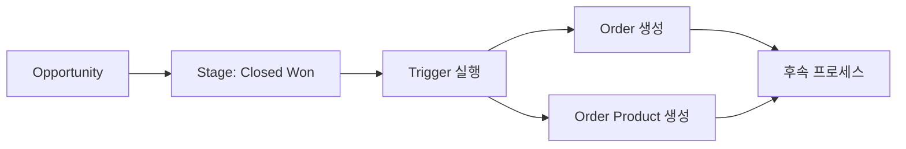

# 🎯 Opportunity Triggers

## 🎯 목적
Opportunity(영업기회) 관련 모든 Triggers를 관리하는 영역입니다.

## ⚡ 포함된 트리거들

### 🏆 **OpportunityTrigger.trigger**
- **대상 객체**: Opportunity
- **트리거 이벤트**: after update
- **주요 기능**:
  - Opportunity가 Closed Won으로 변경 시 자동 Order 생성
  - Order Product 자동 생성
  - 영업 성사 후 후속 프로세스 자동화

### 📊 **트리거 설정**
```apex
trigger OpportunityTrigger on Opportunity (after update) {
    if (Trigger.isAfter && Trigger.isUpdate) {
        List<Opportunity> closedWonOpps = new List<Opportunity>();
        
        for (Opportunity opp : Trigger.new) {
            Opportunity oldOpp = Trigger.oldMap.get(opp.Id);
            
            // StageName이 Closed Won으로 변경된 경우
            if (oldOpp.StageName != 'Closed Won' && opp.StageName == 'Closed Won') {
                closedWonOpps.add(opp);
            }
        }
        
        if (!closedWonOpps.isEmpty()) {
            // Order 및 Order Product 자동 생성 로직 실행
        }
    }
}
```

## 🔗 연관 컴포넌트
- **Related Objects**: 
  - Opportunity (Salesforce 표준 객체)
  - Order (생성 대상 객체)
  - OrderProduct (생성 대상 객체)
- **Integration**: Order Domain과 연동

## 📈 비즈니스 로직
- **영업 성사 감지**: StageName 변경을 모니터링
- **자동 Order 생성**: Closed Won 시 Order 레코드 자동 생성
- **Order Product 생성**: Opportunity Line Item을 기반으로 Order Product 생성
- **프로세스 자동화**: 영업에서 주문으로의 원활한 전환

## 🔄 프로세스 플로우


## 📞 담당자
- **Lead Developer**: Moon JeongHyeon
- **Sales Team**: Opportunity Management Team
- **Operations Team**: Order Management Team

## 📝 사용 가이드
Opportunity에서 Order로의 변환 로직을 수정할 때는 Order Domain의 영향도를 함께 고려하세요.
