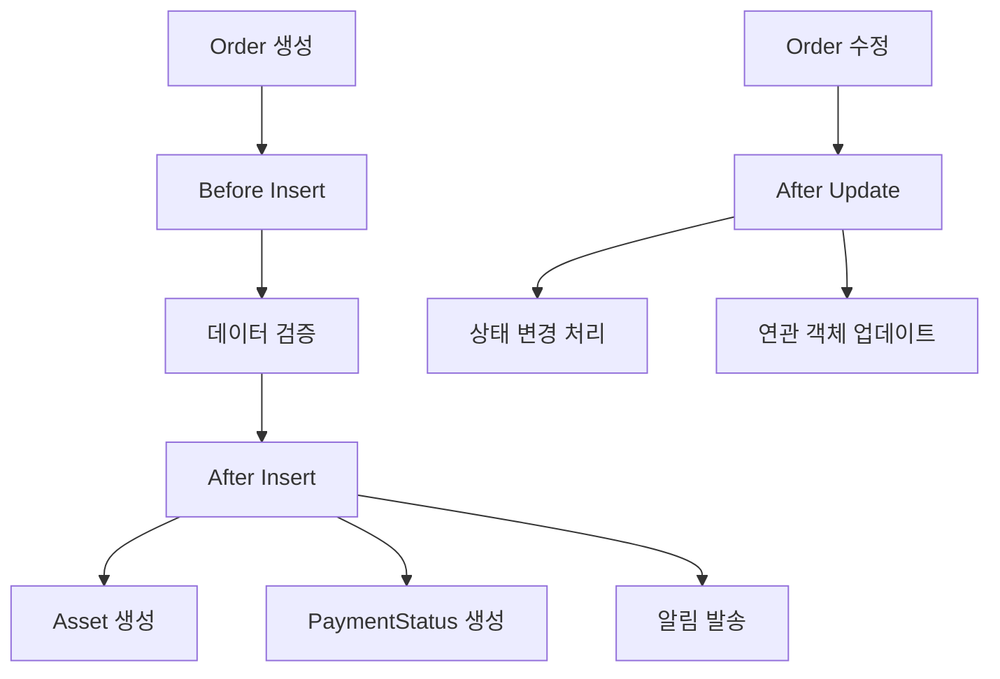

# 📦 Order Triggers

## 🎯 목적
Order(주문) 관련 모든 Triggers를 관리하는 영역입니다.

## ⚡ 포함된 트리거들

### 🔄 **OrderTrigger.trigger**
- **대상 객체**: Order
- **트리거 이벤트**: after insert, after update, before insert
- **핸들러**: OrderTriggerHandler
- **주요 기능**:
  - Order 생성/수정 시 비즈니스 로직 실행
  - 관련 객체들과의 연동 처리
  - TriggerManager 패턴 사용

### 📊 **트리거 설정**
```apex
trigger OrderTrigger on Order (
    after insert, after update, before insert
) {
    TriggerManager.prepare()
        .bind(new OrderTriggerHandler())
        .execute();
}
```

## 🔗 연관 컴포넌트
- **Handler**: OrderTriggerHandler (classes/order_domain/)
- **Manager**: TriggerManager (shared framework)
- **Related Objects**: 
  - Order (Salesforce 표준 객체)
  - Account (고객사)
  - Opportunity (원본 영업기회)
  - Asset (생성될 자산)
  - PaymentStatus (결제 상태)

## 📈 비즈니스 로직
- **Before Insert**: Order 생성 전 데이터 검증 및 기본값 설정
- **After Insert**: Order 생성 후 연관 객체 자동 생성
  - Asset 레코드 생성
  - PaymentStatus 레코드 생성
  - 알림 및 워크플로우 트리거
- **After Update**: Order 상태 변경 시 후속 처리

## 🔄 프로세스 플로우


## 📞 담당자
- **Lead Developer**: JH Moon, Hyowon Hong
- **Business Team**: Order Management Team

## 📝 사용 가이드
Order 관련 새로운 비즈니스 로직 추가 시 OrderTriggerHandler를 수정하여 기능을 확장하세요. Asset이나 PaymentStatus 생성 로직 변경 시 해당 도메인과의 연관성을 고려하세요.
