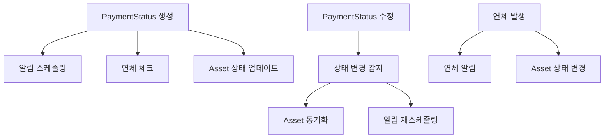

# 💳 Payment Triggers

## 🎯 목적
Payment(납부) 관련 모든 Triggers를 관리하는 영역입니다.

## ⚡ 포함된 트리거들

### 💰 **PaymentStatusTrigger.trigger**
- **대상 객체**: PaymentStatus__c
- **트리거 이벤트**: after insert, after update
- **주요 기능**:
  - 새로운 PaymentStatus 생성 시 알림 스케줄링
  - 연체 상태 자동 체크
  - 납부 상태 변경에 따른 후속 처리

### 🏗️ **PaymentStatusAssetTrigger.trigger**
- **대상 객체**: PaymentStatus__c
- **주요 기능**:
  - PaymentStatus와 Asset 간의 연동 처리
  - Asset 상태 업데이트

### ⚡ **PaymentStatusAssetTriggerEnhanced.trigger**
- **대상 객체**: PaymentStatus__c
- **주요 기능**:
  - 향상된 PaymentStatus-Asset 연동 로직
  - 복잡한 비즈니스 규칙 적용

### 📊 **트리거 설정**
```apex
// 기본 PaymentStatus 트리거
trigger PaymentStatusTrigger on PaymentStatus__c (after insert, after update) {
    if (Trigger.isAfter) {
        if (Trigger.isInsert) {
            // 알림 스케줄링
            PaymentNotificationScheduler.scheduleNotifications(Trigger.new);
            
            // 연체 체크
            PaymentOverdueService.checkNewPaymentStatus(Trigger.new);
        }
        
        if (Trigger.isUpdate) {
            // 상태 변경 처리
        }
    }
}
```

## 🔗 연관 컴포넌트
- **Services**: 
  - PaymentNotificationScheduler (알림 스케줄링)
  - PaymentOverdueService (연체 처리)
- **Related Objects**: 
  - PaymentStatus__c (커스텀 객체)
  - Asset (연관 자산)
  - Order (원본 주문)
  - Account (고객사)

## 📈 비즈니스 로직
- **알림 관리**: 납부 일정 알림 자동 스케줄링
- **연체 관리**: 연체 상태 자동 감지 및 처리
- **Asset 연동**: PaymentStatus 변경 시 Asset 상태 동기화
- **상태 추적**: 납부 상태 변경 이력 관리

## 🔄 프로세스 플로우


## 📞 담당자
- **Lead Developer**: JH Moon
- **Finance Team**: Payment Management Team
- **Customer Service**: Notification Team

## 📝 사용 가이드
- PaymentStatus 관련 로직 수정 시 Asset Domain과의 연관성을 반드시 고려하세요
- 알림 로직 변경 시 고객 경험에 미치는 영향을 검토하세요
- 연체 처리 로직은 법적 요구사항을 준수해야 합니다
