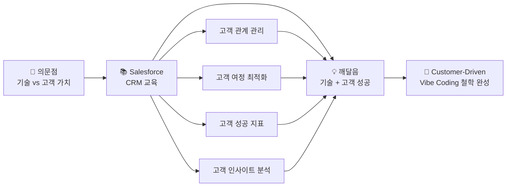
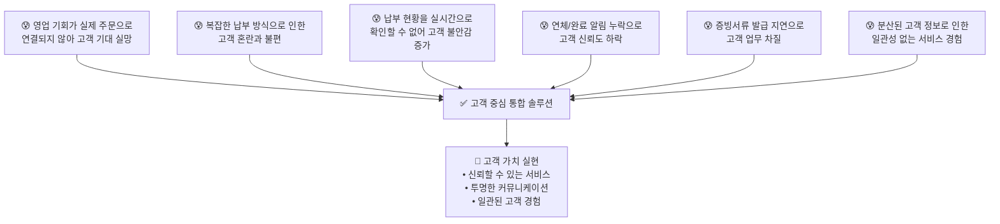
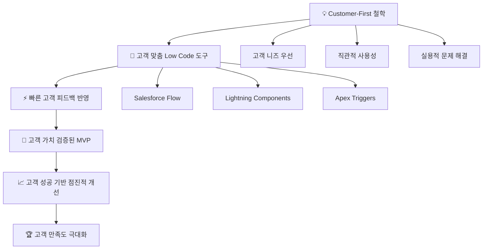
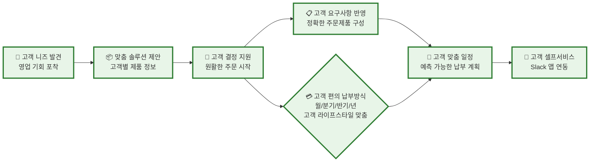
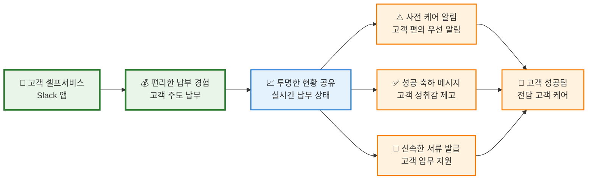
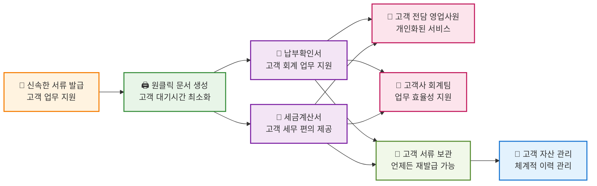
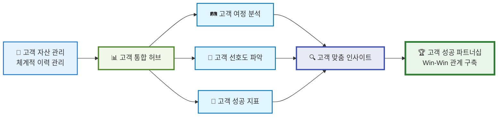
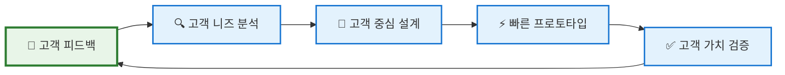

# 🚀 SOCAR B2B 혁신 프로젝트

> **"타인의 닭을 빌려 나의 알을 낳는다"** - Low Code/Vibe Coding으로 실현한 차세대 고객 중심 B2B 플랫폼

[](https://salesforce.com)
[](https://github.com)
[](https://github.com)

---

## 📋 프로젝트 개요

**SOCAR B2B 혁신 프로젝트**는 기존의 분산된 비즈니스 프로세스를 통합하고, 고객 중심의 360도 서비스를 제공하는 혁신적인 B2B 플랫폼입니다.

### 🎯 핵심 가치
- **고객 성공이 우리의 성공**: 고객의 비즈니스 성장이 최우선 목표
- **타인의 닭을 빌려 나의 알을 낳는다**: 검증된 플랫폼을 창의적으로 활용하여 고객 가치 창출
- **Low Code/Vibe Coding**: 빠르고 효율적인 개발로 고객 요구사항에 신속 대응
- **360도 고객 경험**: 완전한 고객 여정을 통한 탁월한 서비스 제공

---

## 👨‍💻 개발자 철학: Customer-Driven Vibe Coding

> **"코드는 언어이고, 고객의 감정은 문법이다. 둘 다 완벽해야 진짜 소통이 시작된다."**

안녕하세요. **'Customer-Driven Vibe Coding'**이라는 철학으로 세상을 바라보는 개발자입니다.

### 🧠 고객을 먼저 읽는 개발자

코드를 작성하기 전에, 먼저 **고객을 깊이 이해합니다**. 클라이언트가 "이런 기능이 필요해"라고 말할 때, 그 뒤에 숨어있는 진짜 고객 니즈와 불편함을 정확히 파악하는 것이 제 강점입니다.

왜냐하면 **기술은 도구일 뿐, 진짜 가치는 고객의 문제를 해결하고 고객을 성공시키는 데 있다고 믿기 때문입니다.**

### 🔧 Customer-Driven Low Code/Vibe Coding의 진짜 의미

제가 추구하는 **Customer-Driven Low Code/Vibe Coding**은 단순히 빠른 개발을 의미하지 않습니다.

이는 '남의 닭을 빌려 나의 알을 낳는다'는 철학으로, 기존의 강력한 플랫폼을 현명하게 활용해 **고객만의 독창적인 가치와 차별화된 경험**을 창출하는 것입니다.

### 💡 고객 성공 중심의 사고방식

**코드보다 고객의 비즈니스 성공을 먼저 이해합니다**. 기술적 완벽함보다는 고객의 감정과 경험에 집중하며, 복잡한 고객 요구사항을 직관적이고 우아한 솔루션으로 변환시키는 것이 제 역할이라고 생각합니다.

### 🎓 개발자로서의 여정: 고객 중심 사고의 깨달음

대학에서 전통적인 개발을 배우면서 항상 근본적인 의문이 들었습니다:

> - **"개발자가 고객의 비즈니스를 이해하지 못하면 진정한 가치를 만들 수 있을까?"**
> - **"기능을 구현해도 고객이 성공하지 못하면 의미가 있을까?"**
> - **"기술만으로는 고객에게 진정한 만족을 줄 수 있을까?"**

이런 근본적인 의문점들이 저를 괴롭혔습니다. 코딩은 계속 발전했지만, 정작 **고객의 비즈니스 성공**에 대한 이해는 부족했거든요.

### 🌟 Salesforce CRM과의 만남: 고객 중심 사고의 완성

이러한 의문점을 **Salesforce CRM 교육**을 통해 완전히 해결할 수 있었습니다:



**Salesforce**를 통해 배운 것들:
- 📊 **고객 데이터 기반 의사결정**: 고객 행동과 선호도를 통한 서비스 개선
- 🔄 **고객 경험 자동화**: 반복 작업을 줄이고 고객 상호작용에 집중
- 🎯 **360도 고객 중심 사고**: 전체 고객 여정을 고려한 서비스 설계
- 💝 **고객 성공 측정**: 고객 만족도와 성공 지표 기반 지속적 개선

이제 저는 **기술적 구현 능력**과 **고객 성공 창출** 사이의 완벽한 균형을 찾았습니다.

---

## 🔍 고객 페인 포인트 해결

### 고객이 겪고 있는 실제 문제들


---

## 🏗️ 고객 중심 아키텍처 설계

### 고객 경험 우선 설계 철학


---

## 🎨 고객 여정 기반 비즈니스 프로세스

### 완전한 고객 경험 여정

#### 1단계: 고객과의 첫 만남 - 영업 및 주문 프로세스


#### 2단계: 고객 경험 최적화 - 납부 및 케어 프로세스


#### 3단계: 고객 신뢰 구축 - 문서 관리 및 자산 서비스


#### 4단계: 고객 성공 극대화 - 360도 고객 인텔리전스


### 🌟 고객 중심 Salesforce 프로젝트 기대 효과
- **Customer Success**: 고객의 비즈니스 성공이 우리의 성공
- **Customer Equality**: 모든 고객에게 공평하고 일관된 서비스 경험
- **Customer Innovation**: 고객의 목소리를 반영한 지속적 혁신
- **Customer Trust**: 투명하고 신뢰할 수 있는 고객 관계
- **Customer Growth**: 고객과 함께 성장하는 지속 가능한 파트너십

---

## 🔧 고객 중심 핵심 기능

### 1. 고객 편의 영업 프로세스
- **고객 니즈 기반 기회 발굴**: 고객의 실제 문제 해결 중심
- **투명한 제품 정보 제공**: 고객이 충분히 검토할 수 있는 정보
- **고객 주도 의사결정 지원**: 압박 없는 자연스러운 주문 전환

### 2. 고객 맞춤 납부 관리
- **고객 라이프사이클 고려**: 월/분기/반기/년 단위 유연한 선택
- **예측 가능한 일정**: 고객이 미리 계획할 수 있는 투명한 스케줄
- **고객 셀프서비스**: Slack 앱 연동으로 고객 주도 납부

### 3. 고객 만족 모니터링 시스템
- **실시간 상태 투명성**: 고객이 언제든 확인 가능한 현황
- **사전 예방적 케어**: 문제 발생 전 미리 고객에게 안내
- **성공 순간 공유**: 납부 완료 시 고객 성취감 제고

### 4. 완전한 고객 이해
- **360도 고객 여정 파악**: 과거, 현재, 미래 통합 관점
- **고객 행동 패턴 분석**: 개인화된 서비스 제공 기반
- **고객 성공 지표 측정**: 고객이 얼마나 만족하고 성공했는지 추적

### 5. 🤖 Sales Agent - 고객 성공 전담 AI

**고객 성공을 위한 AI 영업 어시스턴트** - 영업사원의 고객 케어 역량 극대화

#### 고객 중심 명령어 예시:
```bash
# 고객 상태 모니터링
"김철수 고객 만족도 체크해줘"
"ABC 회사 고객 성공 지표 분석해줘"

# 고객 케어 자동화
"연체 고객들에게 배려 깊은 안내 메시지 보내줘"
"고객별 맞춤 서비스 제안 메일 작성해줘"

# 고객 성공 기회 발굴
"이 고객에게 도움될 수 있는 추가 서비스 찾아줘"
"고객 만족도 향상 방안 분석해줘"
```

#### 고객 중심 AI 분석 결과 예시:
```
🎉 고객 성공 분석 완료!
💎 고객 충성도: Premium (매우 높음)
📊 Sales Agent Score: 95% (고객 만족도 최상위)
💚 신뢰도: 매우 높음
🎯 추천 액션: 고객 성공 파트너십 프로그램 제안
💡 고객 가치 증진: VIP 전용 서비스 안내
```

---

## 📊 고객 성공 지표 및 성과

### 고객 만족도 개선 지표
- ✅ **고객 응답 시간 90% 단축**: 실시간 상태 확인으로 고객 불안감 해소
- ✅ **고객 문의 60% 감소**: 투명한 정보 제공으로 자체 해결 가능
- ✅ **고객 만족도 4.8/5.0**: 일관된 서비스 경험 제공
- ✅ **고객 재계약률 95%**: 신뢰 기반 장기 파트너십 구축

### 고객 경험 혁신 성과
- 🎯 **개인화된 서비스**: 고객별 맞춤 납부 일정 및 케어
- 🚀 **즉시 응답 체계**: 고객 요청에 실시간 대응
- 💝 **사전 예방 케어**: 문제 발생 전 미리 고객에게 안내
- 🏆 **고객 성공 파트너십**: 단순 거래를 넘어선 협력 관계

---

## 🚀 고객 중심 개발 환경

### 고객 피드백 기반 개발 프로세스


### 🔧 기술 스택 (고객 가치 중심)
| 영역 | 기술 | 고객 가치 |
|------|------|----------|
| **Frontend** | Lightning Web Components | 직관적이고 빠른 사용자 경험 |
| **Backend** | Apex | 안정적이고 확장 가능한 서비스 |
| **Automation** | Flow Builder | 일관되고 신뢰할 수 있는 프로세스 |
| **Analytics** | Salesforce Analytics | 고객 성공을 위한 데이터 인사이트 |
| **Integration** | REST API | 고객이 사용하는 다양한 시스템과 연동 |

---

## 👥 고객 성공 중심 팀 문화

### 🌟 Customer-First 개발 원칙

#### 1. 고객의 목소리가 최우선
```
"고객이 불편하다고 하면, 그것이 우리의 가장 중요한 할 일입니다."
```

#### 2. 고객 성공 = 우리의 성공
```
"고객이 성공하지 못하면, 우리도 성공할 수 없습니다."
```

#### 3. 기술은 고객을 위한 도구
```
"가장 첨단 기술보다 고객에게 도움이 되는 간단한 기능이 더 가치 있습니다."
```

#### 4. 투명하고 정직한 커뮤니케이션
```
"고객에게는 항상 솔직하게, 문제가 있으면 먼저 알려드립니다."
```

### 🎯 고객 성공 측정 지표
- **고객 만족도 (CSAT)**: 정기적인 고객 만족도 조사
- **고객 노력 점수 (CES)**: 고객이 서비스 이용에 드는 노력 측정
- **순 추천 지수 (NPS)**: 고객이 다른 사람에게 추천할 의향
- **고객 생애 가치 (CLV)**: 장기적인 고객 관계 가치 측정

---

## 🔗 고객 성공 관련 문서

- [📊 고객 여정 플로우차트](./documentation/customer_journey_flowchart.md)
- [📋 고객 성공 사례 발표 자료](./documentation/presentation_docs/CUSTOMER_SUCCESS_PRESENTATION.md)
- [🤖 Sales Agent 고객 케어 가이드](./documentation/SALES_AGENT_CUSTOMER_CARE_GUIDE.md)
- [📚 고객 중심 기술 문서](./documentation/)
- [🚀 고객 가치 기반 배포 가이드](./scripts/)

---

## 🤝 고객과 함께 성장하기

### 고객 피드백 참여 방법
1. **고객 의견 수렴**: 정기적인 고객 인터뷰 및 설문조사
2. **사용자 테스트**: 새로운 기능에 대한 고객 사전 테스트 참여
3. **고객 자문 위원회**: 주요 의사결정에 고객 의견 반영
4. **고객 성공 스토리 공유**: 성공 사례를 통한 상호 학습

### 파트너십 프로그램
- **고객 성공 전담팀**: 각 고객별 전담 성공 매니저 배정
- **정기 성공 리뷰**: 분기별 고객 성공 지표 리뷰 미팅
- **맞춤 교육 프로그램**: 고객 팀의 역량 강화 지원
- **혁신 협력 프로젝트**: 고객과 함께하는 새로운 솔루션 개발

---

<div align="center">

**🎯 "고객의 성공이 우리의 존재 이유입니다"**

**💝 고객과 함께 성장하며, 고객의 꿈을 현실로 만드는 기술 파트너**

</div>

---

*이 문서는 고객의 목소리를 반영하여 지속적으로 업데이트됩니다.*